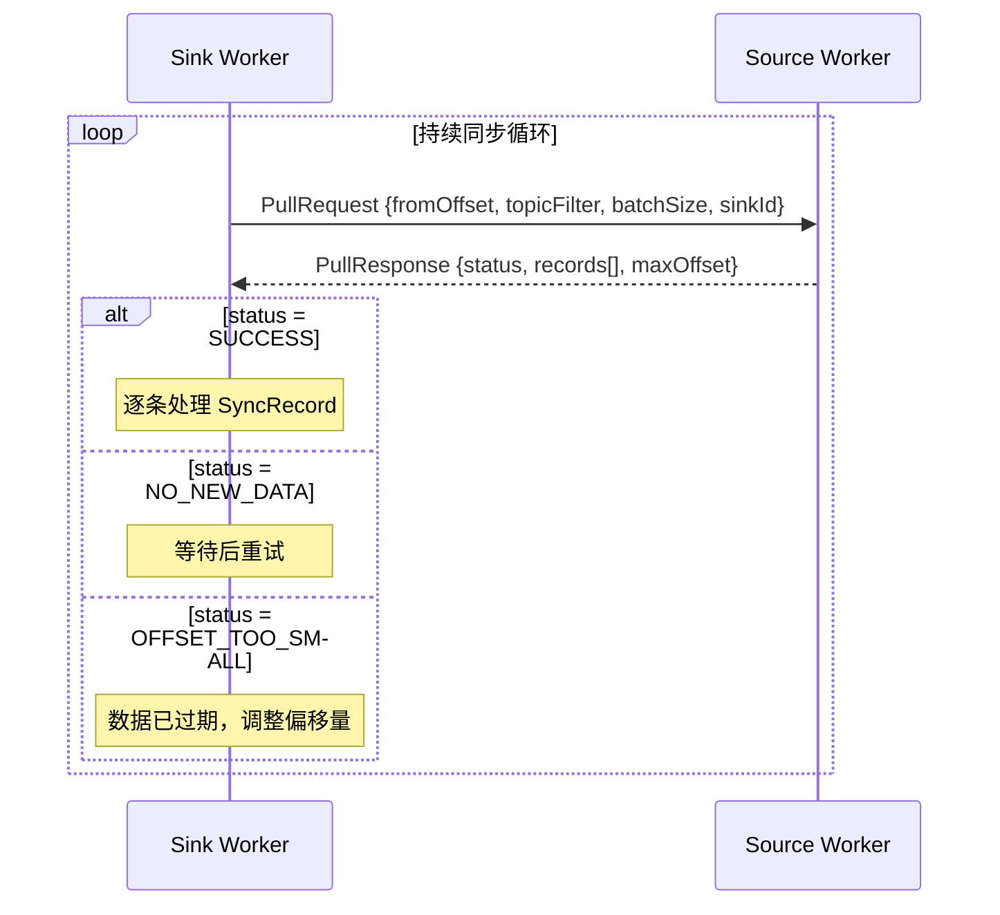
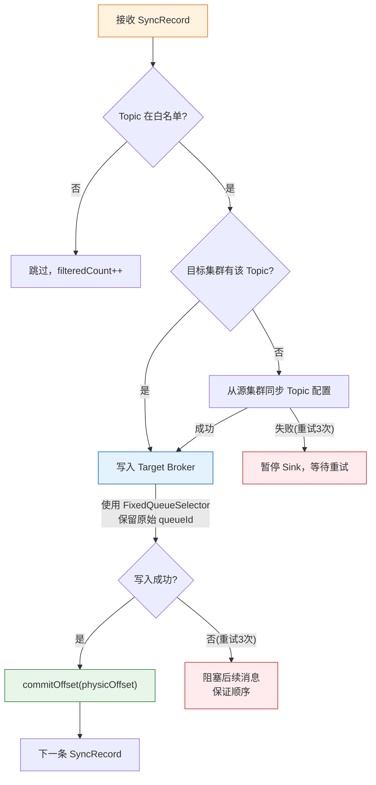
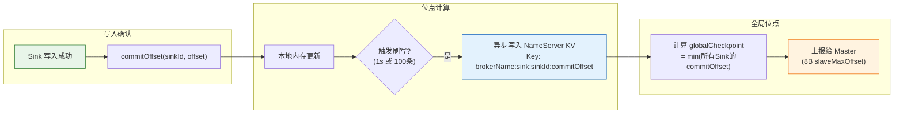

# RocketMQ HA Data Sync

> 基于 RocketMQ 原生 HA 协议的跨集群数据同步组件

---

## 📖 项目介绍

RocketMQ HA Data Sync 是一个**独立的 Java 程序**，模拟 RocketMQ Slave Broker 的主从复制行为，从存储层角度实现跨集群数据同步。

组件通过 NameServer 发现源集群的 Master Broker，以「虚拟 Slave」身份使用 RocketMQ 原生 HA 复制协议（`DefaultHAService`）建立 TCP 连接，持续拉取 CommitLog 数据，解析后写入目标 RocketMQ 集群。

### 核心特性

| 特性 | 说明 |
|------|------|
| **Source/Sink 解耦** | Source 专注数据拉取，Sink 专注数据写入，可独立扩展 |
| **独立部署** | Source 和 Sink 作为独立 Worker 进程，通过 ZeroMQ（REQ-REP）通信 |
| **完全无状态** | 所有状态存储在目标集群 NameServer KV 中，可随意迁移替换 |
| **消息顺序一致** | 按源集群 CommitLog 物理偏移量严格升序写入目标集群 |
| **最终一致性** | At-Least-Once 语义 + 启动一致性校验，不丢消息 |
| **不参与选举** | 仅使用基础 Slave 协议，不影响源集群主从切换 |
| **高可用** | Master 切换自动重连、断点续传、目标不可写探活 |
| **全链路 Trace** | 端到端追踪 + 丰富监控指标 |
| **自动重试** | 网络抖动容错，指数退避重试 |
| **元数据同步** | 全量元数据 + Topic 按需同步 |

### 适用场景

- 🌐 跨机房数据同步
- 🛡️ 灾备集群数据复制
- 🚀 数据迁移
- 🔄 多活架构数据同步

---

## 🏗️ 系统架构

```
┌──────────────────────────────────────────────────────────────────────┐
│                          Sync Pipeline                               │
│                                                                      │
│  ┌───────────────────┐                       ┌────────────────────┐  │
│  │    HASource        │   SyncRecord Queue   │ Sink (分布式多节点) │  │
│  │   (单节点拉取)     │ ──────────────────►  │ (写入目标 RocketMQ) │  │
│  └───────────────────┘                       └────────────────────┘  │
│          │                                            │              │
│   CheckpointCoordinator（位点协调器） ◄───────────────┘              │
└──────────────────────────────────────────────────────────────────────┘
         │                                              │
         ▼                                              ▼
  ┌──────────────┐                           ┌───────────────────┐
  │ 源集群 Master │                           │ 目标集群 RocketMQ  │
  │ (HA 协议 TCP) │                           │ (消息写入)         │
  └──────────────┘                           └───────────────────┘
```

- **Source Worker**（单节点）：连接源集群 Master、拉取 CommitLog、解析消息、通过 ZeroMQ 提供数据服务
- **Sink Worker**（可多节点）：从 Source 拉取数据，按 Topic 流量负载均衡写入目标集群
- **CheckpointCoordinator**：协调 Source/Sink 位点，持久化到 NameServer KV

---

## 🔄 数据流架构

### 端到端数据流全景

下图展示了一条消息从源集群 Master 到目标集群的完整流转路径：

```mermaid
flowchart LR
    subgraph SRC["🏢 源集群"]
        NS_A["NameServer A"]
        MASTER["Master Broker<br/>(CommitLog)"]
    end

    subgraph SOURCE_W["⚙️ Source Worker (单节点)"]
        direction TB
        HA["HA Connection<br/>(Slave 协议 TCP)"]
        PARSER["CommitLog Parser<br/>(magicCode / CRC / 解析)"]
        BUFFER["SyncRecord 缓冲区<br/>(内存有界队列)"]
        ZMQ_REP["ZeroMQ REP Socket<br/>(:5555)"]
        RFQ["RFQ Sink<br/>(解析失败处理)"]
        META["MetadataSync<br/>(元数据同步)"]
        STATS["Topic 流量统计"]
    end

    subgraph SINK_W["📦 Sink Worker × N (分布式)"]
        direction TB
        ZMQ_REQ["ZeroMQ REQ Client"]
        FILTER["Topic Filter<br/>(白名单过滤)"]
        ONDEMAND["Topic 按需同步<br/>(自动建 Topic)"]
        WRITER["RocketMQ Producer<br/>(严格顺序写入)"]
        CKPT["CheckpointCoordinator<br/>(位点管理)"]
    end

    subgraph TGT["🏢 目标集群"]
        NS_B["NameServer B<br/>(KV 存储)"]
        BROKER_B["Target Broker"]
    end

    NS_A -->|发现 Master HA 地址| HA
    MASTER ==>|"HA 协议 TCP<br/>[offset(8B) + size(4B) + body]"| HA
    HA --> PARSER
    PARSER -->|解析成功| BUFFER
    PARSER -->|"解析失败"| RFQ
    RFQ -->|写入源集群 RFQ Topic| MASTER
    BUFFER --> ZMQ_REP
    PARSER --> STATS
    META -.->|"定时全量同步(60s)"| NS_A

    ZMQ_REQ -->|"PullRequest<br/>{fromOffset, batchSize}"| ZMQ_REP
    ZMQ_REP -->|"PullResponse<br/>{records[], maxOffset}"| ZMQ_REQ
    ZMQ_REQ --> FILTER
    FILTER -->|白名单命中| ONDEMAND
    ONDEMAND -->|"目标不存在?<br/>自动从源集群同步"| WRITER
    WRITER ==>|"严格按 physicOffset 顺序<br/>保留原始 queueId"| BROKER_B
    WRITER -->|写入成功| CKPT
    CKPT -->|"异步刷写 commitOffset"| NS_B

    style SRC fill:#e8f5e9,stroke:#2e7d32,stroke-width:2px
    style TGT fill:#e3f2fd,stroke:#1565c0,stroke-width:2px
    style SOURCE_W fill:#fff3e0,stroke:#ef6c00,stroke-width:2px
    style SINK_W fill:#fce4ec,stroke:#c62828,stroke-width:2px
```



### 数据流转阶段详解

整个数据同步分为 **5 个阶段**，每个阶段承担不同的职责：

#### 阶段 ① 数据拉取（Source 侧）

```
Master Broker ──TCP──► HASource
  [masterPhyOffset(8B) + bodySize(4B) + CommitLog Body]
```

| 步骤 | 操作 | 说明 |
|------|------|------|
| 1 | NameServer 发现 | 通过 `GET_BROKER_CLUSTER_INFO` 获取 Master HA 地址 |
| 2 | TCP 连接建立 | 使用 DefaultHAService Slave 协议（不参与选举） |
| 3 | 偏移量上报 | 定时发送 8 字节 `slaveMaxOffset`（= globalCheckpoint） |
| 4 | 数据包接收 | 接收二进制 CommitLog 数据包 |

#### 阶段 ② 消息解析（Source 侧）

```
CommitLog 二进制 ──解析──► SyncRecord[]
```

| 步骤 | 操作 | 说明 |
|------|------|------|
| 1 | magicCode 校验 | 验证 `0xdaa320a7` 消息魔数 |
| 2 | totalSize 校验 | 检查 >20B 且 ≤4MB |
| 3 | bodyCRC 校验 | 完整性校验 |
| 4 | 消息头解析 | 提取 topic、queueId、body、storeTimestamp 等 |
| 5 | traceId 生成 | 附加全链路追踪 ID |
| 6 | 流量统计 | 按 Topic 累计字节数，供 Sink 负载均衡 |
| 7 | 失败处理 | 解析失败 → 写入源集群 RFQ Topic，不丢原始数据 |

#### 阶段 ③ 数据传输（Source → Sink）

```
Source ZMQ REP ◄──PullRequest── Sink ZMQ REQ
Source ZMQ REP ──PullResponse──► Sink ZMQ REQ
```

采用 **ZeroMQ REQ-REP 模式**（拉模型），Sink 主动拉取：



| 字段 | 方向 | 说明 |
|------|------|------|
| `fromOffset` | Sink→Source | 请求起始偏移量 |
| `topicFilter` | Sink→Source | Topic 白名单（可选） |
| `batchSize` | Sink→Source | 单次拉取最大条数 |
| `records[]` | Source→Sink | SyncRecord 数组（按 physicOffset 升序） |
| `maxOffset` | Source→Sink | Source 当前最大偏移量 |

#### 阶段 ④ 消息写入（Sink 侧）

```
SyncRecord ──过滤──► 按需同步 ──► 顺序写入 ──► 推进位点
```



**关键保证**：
- ✅ **严格顺序**：按 `physicOffset` 升序写入，写入失败时阻塞后续消息
- ✅ **Queue 映射**：使用 `FixedQueueSelector` 保留原始 `queueId`
- ✅ **属性透传**：保留 `ORIGIN_PHYSICAL_OFFSET` 和 `SYNC_TRACE_ID`
- ✅ **At-Least-Once**：先写数据、确认成功、再推进位点

#### 阶段 ⑤ 位点管理（Checkpoint）



**Checkpoint 刷写触发条件**（满足任一即触发）：
- ⏱️ 距上次刷写超过 `checkpointFlushInterval`（默认 1000ms）
- 📦 累计处理 `checkpointFlushBatchSize`（默认 100）个数据包
- 🛑 优雅停机时同步强制刷写

### 异常处理数据流

系统对各类异常采取不同的数据流转策略：

```
异常类型                    处理策略                      数据流向
─────────────────────────────────────────────────────────────────────
Master 断连               指数退避重连(1s→30s)          暂停拉取，Sink 等待
CommitLog 解析失败        写入 RFQ Topic                 原始数据 → 源集群 RFQ
Topic 在目标不存在        自动创建(重试3次)              暂停写入 → 恢复
目标集群不可写            探活等待(30s间隔)              阻塞，不丢弃
Checkpoint 刷写失败       内存保留，下次重试             位点不推进
网络闪断                  自动重连 + 断点续传            从 Checkpoint 恢复
```

### NameServer KV 数据模型

所有状态均持久化到**目标集群 NameServer KV**，保证组件完全无状态：

```
NameServer KV Store
├── Namespace: SYNC_SOURCE_CONFIG
│   └── Key: {brokerName}
│       └── Value: {host}:{zmqPort}:{timestamp}     ← Source 地址注册
│
└── Namespace: SYNC_CHECKPOINT
    ├── Key: {brokerName}:globalCheckpoint
    │   └── Value: {minOffset}                        ← 所有 Sink 最小位点
    ├── Key: {brokerName}:sink:{sinkId}:commitOffset
    │   └── Value: {offset}                           ← 各 Sink 已提交位点
    └── Key: {brokerName}:source:topicStats
        └── Value: {topic1:bytes,topic2:bytes,...}    ← Topic 流量统计
```

---

## 📁 项目结构

```
rocketmq-ha-sync/
├── pom.xml                                    # Maven 项目配置
├── README.md                                  # 本文件
├── docker-compose.yml                         # 双集群测试环境编排
├── doc/
│   └── ha-data-sync/
│       ├── requirements.md                    # 需求文档（20 个需求）
│       └── design.md                          # 技术设计文档（2700+ 行）
├── docker/
│   ├── broker-a.conf                          # 源集群 Master Broker 配置
│   ├── broker-a-s.conf                        # 源集群 Slave Broker 配置
│   ├── broker-b.conf                          # 目标集群 Master Broker 配置
│   └── broker-b-s.conf                        # 目标集群 Slave Broker 配置
└── src/
    ├── main/
    │   ├── java/org/apache/rocketmq/hasync/
    │   │   ├── alert/                         # 告警模块
    │   │   │   ├── AlertEvaluator.java         # 告警规则评估器（阈值检测 + 通知）
    │   │   │   └── MetricsLogPrinter.java      # 指标日志定时打印器
    │   │   ├── bootstrap/                     # 启动引导
    │   │   │   ├── HASyncMain.java             # 统一入口（--mode 分发）
    │   │   │   ├── SourceBootstrap.java         # Source 进程启动器
    │   │   │   └── SinkBootstrap.java           # Sink 进程启动器
    │   │   ├── checkpoint/                    # 位点管理
    │   │   │   ├── CheckpointCoordinatorImpl.java # Checkpoint 协调器实现
    │   │   │   └── StartupConsistencyChecker.java # 启动一致性校验器
    │   │   ├── config/                        # 配置管理
    │   │   │   ├── AbstractConfig.java          # 配置基类（三层合并）
    │   │   │   ├── SourceConfig.java            # Source 配置
    │   │   │   └── SinkConfig.java              # Sink 配置
    │   │   ├── core/                          # 核心接口
    │   │   │   ├── SyncSource.java              # 数据源接口
    │   │   │   ├── SyncSink.java                # 数据写入接口
    │   │   │   ├── SyncSinkFactory.java         # Sink 工厂接口
    │   │   │   ├── SyncPipeline.java            # 管道编排
    │   │   │   └── CheckpointCoordinator.java   # 位点协调器接口
    │   │   ├── metrics/                       # 监控指标
    │   │   │   ├── MetricsCollector.java        # 指标采集器（滑动窗口 + 原子计数）
    │   │   │   └── MetricsHttpServer.java       # HTTP 指标暴露（Prometheus 兼容）
    │   │   ├── model/                         # 数据模型
    │   │   │   ├── SyncRecord.java              # 数据传输核心模型
    │   │   │   ├── PullRequest.java             # 拉取请求
    │   │   │   ├── PullResponse.java            # 拉取响应
    │   │   │   ├── ResponseStatus.java          # 响应状态枚举
    │   │   │   ├── ReplicaFailRecord.java       # 解析失败消息模型
    │   │   │   └── ConfigEntry.java             # 配置项条目
    │   │   ├── reliability/                   # 可靠性增强
    │   │   │   ├── GracefulShutdownHandler.java  # 优雅停机处理器
    │   │   │   ├── SnapshotWriter.java           # 快照文件写入器
    │   │   │   └── MetadataSyncService.java      # 元数据同步服务
    │   │   ├── sink/                          # Sink 数据写入
    │   │   │   ├── RocketMQSink.java             # RocketMQ Sink 主实现
    │   │   │   ├── TopicFilter.java              # Topic 白名单过滤器
    │   │   │   ├── TopicOnDemandSync.java        # Topic 按需同步
    │   │   │   ├── SinkRetryPolicy.java          # 写入重试策略（指数退避）
    │   │   │   └── FixedQueueSelector.java       # 固定 Queue 选择器（顺序保证）
    │   │   ├── source/                        # Source 数据拉取
    │   │   │   ├── HASource.java                 # 完整 SyncSource 实现
    │   │   │   ├── HASourceConnection.java       # HA TCP 连接管理器
    │   │   │   ├── CommitLogParser.java          # CommitLog 消息解析器
    │   │   │   ├── MasterDiscovery.java          # NameServer Master 地址发现
    │   │   │   ├── SourceRegistry.java           # Source ZMQ 地址注册
    │   │   │   └── RfqSink.java                  # 解析失败消息 RFQ 写入
    │   │   └── trace/                         # 全链路追踪
    │   │       └── TraceCollector.java           # Trace 采集器（环形缓冲 + P99 计算）
    │   └── resources/
    │       ├── ha-sync-source.properties       # Source 默认配置模板
    │       ├── ha-sync-sink.properties         # Sink 默认配置模板
    │       └── logback.xml                     # 日志配置
    └── test/                                  # 测试代码（388 个测试用例）
        ├── java/org/apache/rocketmq/hasync/
        │   ├── alert/
        │   │   ├── AlertEvaluatorTest.java      # 告警评估器测试
        │   │   └── MetricsLogPrinterTest.java   # 指标打印器测试
        │   ├── bootstrap/
        │   │   └── HASyncMainTest.java          # 入口类测试
        │   ├── checkpoint/
        │   │   ├── CheckpointCoordinatorImplTest.java # Checkpoint 实现测试
        │   │   └── StartupConsistencyCheckerTest.java # 一致性校验测试
        │   ├── config/
        │   │   ├── SourceConfigTest.java        # Source 配置测试
        │   │   └── SinkConfigTest.java          # Sink 配置测试
        │   ├── core/
        │   │   └── SyncPipelineTest.java        # 管道编排测试
        │   ├── e2e/                           # 端到端测试（78 用例）
        │   │   ├── EndToEndDataFlowTest.java    # 数据流 E2E
        │   │   ├── EndToEndConfigBootstrapTest.java # 配置链路 E2E
        │   │   ├── EndToEndErrorRecoveryTest.java   # 异常恢复 E2E
        │   │   ├── EndToEndGracefulShutdownTest.java # 优雅停机 E2E
        │   │   └── EndToEndExceptionScenariosTest.java # 异常场景 E2E
        │   ├── infra/
        │   │   ├── ClusterDependentTest.java    # 集群依赖测试基类
        │   │   └── RocketMQClusterManager.java  # 测试集群管理器
        │   ├── metrics/
        │   │   ├── MetricsCollectorTest.java    # 指标采集测试
        │   │   └── MetricsHttpServerTest.java   # HTTP 指标暴露测试
        │   ├── model/
        │   │   ├── SyncRecordTest.java          # 核心模型测试
        │   │   ├── PullRequestTest.java         # 拉取请求测试
        │   │   ├── PullResponseTest.java        # 拉取响应测试
        │   │   ├── ResponseStatusTest.java      # 响应状态测试
        │   │   └── ConfigEntryTest.java         # 配置项测试
        │   ├── reliability/
        │   │   ├── GracefulShutdownHandlerTest.java # 优雅停机测试
        │   │   ├── SnapshotWriterTest.java      # 快照写入测试
        │   │   └── MetadataSyncServiceTest.java # 元数据同步测试
        │   ├── report/
        │   │   └── TestReportGenerator.java     # 测试报告生成器
        │   ├── sink/
        │   │   ├── RocketMQSinkTest.java        # Sink 主实现测试
        │   │   ├── TopicFilterTest.java         # Topic 过滤测试
        │   │   ├── TopicOnDemandSyncTest.java   # 按需同步测试
        │   │   ├── SinkRetryPolicyTest.java     # 重试策略测试
        │   │   └── FixedQueueSelectorTest.java  # Queue 选择器测试
        │   ├── source/
        │   │   ├── CommitLogParserTest.java     # CommitLog 解析测试
        │   │   ├── HASourceConnectionTest.java  # HA 连接测试
        │   │   ├── MasterDiscoveryTest.java     # Master 发现测试
        │   │   └── RfqSinkTest.java             # RFQ 写入测试
        │   └── trace/
        │       └── TraceCollectorTest.java      # Trace 采集测试
        └── resources/
            └── logback-test.xml               # 测试日志配置
```

---

## 🛠️ 开发指南

### 环境要求

| 依赖 | 版本要求 |
|------|---------|
| **JDK** | 1.8+ |
| **Maven** | 3.6+ |
| **RocketMQ** | 5.1.0（源集群 & 目标集群） |

### 核心依赖

| 依赖 | 版本 | 用途 |
|------|------|------|
| `rocketmq-client` | 5.1.0 | RocketMQ 客户端 |
| `rocketmq-tools` | 5.1.0 | Admin API |
| `rocketmq-remoting` | 5.1.0 | 远程通信 |
| `rocketmq-common` | 5.1.0 | 通用工具 |
| `jeromq` | 0.5.3 | ZeroMQ 纯 Java 实现（Source↔Sink 通信） |
| `fastjson2` | 2.0.39 | JSON 序列化 |
| `logback-classic` | 1.2.12 | 日志框架 |
| `junit` | 4.13.2 | 单元测试 |
| `mockito-core` | 3.12.4 | Mock 测试 |

### 快速开始

```bash
# 1. 克隆项目
git clone <repo-url>
cd rocketmq-ha-sync

# 2. 编译
mvn clean compile

# 3. 运行单元测试
mvn test

# 4. 打包（生成可执行 fat-jar）
mvn clean package -DskipTests
```

打包产物位于 `target/rocketmq-ha-sync-1.0.0-SNAPSHOT.jar`。

### 配置优先级

配置采用**三层合并**机制，优先级从高到低：

```
环境变量  >  命令行参数  >  配置文件  >  默认值
```

例如，`sourceNamesrv` 的加载顺序：
1. 环境变量 `SOURCE_NAMESRV`（自动将驼峰转为大写下划线）
2. 命令行参数 `--sourceNamesrv 127.0.0.1:9876`
3. 配置文件 `ha-sync-source.properties` 中的 `sourceNamesrv=...`
4. 代码中定义的默认值

### 开发阶段

| 阶段 | 需求 | 内容 | 状态 |
|------|------|------|------|
| **阶段一：基础骨架** | 需求 1~3 | 配置管理、核心接口、不参与选举约束 | ✅ 已完成 |
| **阶段二：Source 核心** | 需求 4~8 | NameServer 发现、兼容性校验、CommitLog 解析、Master 重连 | ✅ 已完成 |
| **阶段三：Checkpoint** | 需求 9~10 | 位点持久化、启动一致性校验、最终一致性语义 | ✅ 已完成 |
| **阶段四：Sink 核心** | 需求 11~13 | Topic 过滤、按需同步、消息写入、重试策略 | ✅ 已完成 |
| **阶段五：可靠性增强** | 需求 14~16 | 优雅停机、快照、元数据同步 | ✅ 已完成 |
| **阶段六：监控 + 可观测** | 需求 17~19 | 全链路 Trace、分布式负载均衡、告警评估 | ✅ 已完成 |
| **阶段七：联调 + 压测** | 需求 20 | 监控指标打印、Prometheus 集成、端到端联调 | ✅ 已完成 |

### 测试统计

```
总测试用例: 388   通过: 388   失败: 0   跳过: 0
构建状态:   BUILD SUCCESS
```

| 测试类别 | 用例数 | 覆盖内容 |
|---------|--------|---------|
| **模型层单元测试** | 55 | SyncRecord、PullRequest/Response、ConfigEntry、ReplicaFailRecord |
| **配置层单元测试** | 25 | SourceConfig、SinkConfig（三层合并、敏感掩码） |
| **核心层单元测试** | 20 | SyncPipeline（管道编排、异常回滚） |
| **Source 单元测试** | 40 | CommitLogParser、MasterDiscovery、HASourceConnection、RfqSink |
| **Sink 单元测试** | 45 | TopicFilter、TopicOnDemandSync、RocketMQSink、SinkRetryPolicy、FixedQueueSelector |
| **Checkpoint 单元测试** | 25 | CheckpointCoordinatorImpl、StartupConsistencyChecker |
| **可靠性单元测试** | 30 | GracefulShutdownHandler、SnapshotWriter、MetadataSyncService |
| **监控/告警单元测试** | 35 | MetricsCollector、MetricsHttpServer、TraceCollector、AlertEvaluator、MetricsLogPrinter |
| **启动类单元测试** | 10 | HASyncMain |
| **基础设施测试** | 25 | ClusterDependentTest、RocketMQClusterManager、TestReportGenerator |
| **端到端测试（E2E）** | 78 | 数据流、配置链路、异常恢复、优雅停机、异常场景 |

### 编码规范

- **Java 版本**：1.8，不使用更高版本的语法特性
- **编码格式**：UTF-8
- **日志框架**：SLF4J + Logback，禁止直接使用 `System.out`
- **配置敏感项**：包含 `password`、`secret`、`token` 的配置项，日志输出时自动掩码为 `******`
- **异常处理**：所有 IO 操作必须有完善的异常处理和日志

---

## 🚀 部署说明

### 前置条件

1. 源集群和目标集群的 RocketMQ 均已部署并正常运行
2. Source 节点能够通过网络访问源集群 NameServer 和 Master Broker 的 HA 端口
3. Sink 节点能够通过网络访问目标集群 NameServer 和 Broker
4. Source 和 Sink 之间的 ZeroMQ 端口（默认 5555）网络可达

### 构建

```bash
mvn clean package -DskipTests
```

### 部署 Source

Source 以单节点方式运行，负责连接源集群 Master 拉取 CommitLog 数据。

#### 方式一：命令行参数

```bash
java -jar rocketmq-ha-sync-1.0.0-SNAPSHOT.jar \
  --mode source \
  --sourceNamesrv 10.0.0.1:9876 \
  --targetNamesrv 10.0.0.2:9876 \
  --zmqBindPort 5555
```

#### 方式二：配置文件

编辑 `ha-sync-source.properties`：

```properties
# === 必填 ===
sourceNamesrv=10.0.0.1:9876;10.0.0.3:9876
targetNamesrv=10.0.0.2:9876

# === 可选（以下为默认值）===
sourceMetricsPort=9876
heartbeatInterval=5000
masterPollInterval=30000
checkpointFlushInterval=1000
checkpointFlushBatchSize=100
zmqBindPort=5555
rfqTopic=ha-sync-rfq
rfqProducerGroup=ha-sync-rfq-producer
rfqMaxRetry=3
parseErrorSuspendWindowMs=60000
metaSyncInterval=60000
```

启动：

```bash
java -jar rocketmq-ha-sync-1.0.0-SNAPSHOT.jar --mode source
```

#### 方式三：环境变量

```bash
export SOURCE_NAMESRV=10.0.0.1:9876
export TARGET_NAMESRV=10.0.0.2:9876
export ZMQ_BIND_PORT=5555

java -jar rocketmq-ha-sync-1.0.0-SNAPSHOT.jar --mode source
```

### 部署 Sink

Sink 支持分布式多节点部署，自动从 NameServer KV 发现 Source 地址。

#### 方式一：命令行参数

```bash
java -jar rocketmq-ha-sync-1.0.0-SNAPSHOT.jar \
  --mode sink \
  --targetNamesrv 10.0.0.2:9876 \
  --sinkId sink-node-01 \
  --sinkBatchSize 100 \
  --sinkThreads 4
```

#### 方式二：配置文件

编辑 `ha-sync-sink.properties`：

```properties
# === 必填 ===
targetNamesrv=10.0.0.2:9876

# === 可选（以下为默认值）===
sinkMetricsPort=9877
sinkId=sink-node-01
sinkBatchSize=100
sinkThreads=4
sinkMaxRetry=3
targetProbeInterval=30000
startupCheckMsgCount=10
topicSyncMaxRetry=3
```

启动：

```bash
java -jar rocketmq-ha-sync-1.0.0-SNAPSHOT.jar --mode sink
```

### 典型部署拓扑

```
         源集群                                     目标集群
┌─────────────────┐                        ┌─────────────────┐
│  NameServer (A) │                        │  NameServer (B) │
│  Master Broker  │◄── HA TCP ──┐          │  Target Broker  │
└─────────────────┘             │          └────────▲────────┘
                                │                   │
                         ┌──────┴──────┐     ┌──────┴──────┐
                         │   Source    │     │  Sink × N   │
                         │  Worker    │────►│  Workers    │
                         │  (单节点)  │ ZMQ │  (分布式)   │
                         └─────────────┘     └─────────────┘
```

### JVM 参数推荐

```bash
# Source 节点（内存需求较小）
java -Xms512m -Xmx1g \
  -XX:+UseG1GC \
  -XX:MaxGCPauseMillis=50 \
  -jar rocketmq-ha-sync-1.0.0-SNAPSHOT.jar --mode source ...

# Sink 节点（多线程写入，适当增加内存）
java -Xms1g -Xmx2g \
  -XX:+UseG1GC \
  -XX:MaxGCPauseMillis=100 \
  -jar rocketmq-ha-sync-1.0.0-SNAPSHOT.jar --mode sink ...
```

---

## 📖 使用说明

### Source 配置参数

| 参数 | 环境变量 | 默认值 | 必填 | 说明 |
|------|---------|--------|------|------|
| `sourceNamesrv` | `SOURCE_NAMESRV` | — | ✅ | 源集群 NameServer 地址（多个以 `;` 分隔） |
| `targetNamesrv` | `TARGET_NAMESRV` | — | ✅ | 目标集群 NameServer 地址 |
| `sourceMetricsPort` | `SOURCE_METRICS_PORT` | `9876` | — | Source HTTP 监控端口 |
| `heartbeatInterval` | `HEARTBEAT_INTERVAL` | `5000` | — | 向 Master 上报偏移量间隔（ms） |
| `masterPollInterval` | `MASTER_POLL_INTERVAL` | `30000` | — | 轮询 NameServer 检测 Master 变更间隔（ms） |
| `checkpointFlushInterval` | `CHECKPOINT_FLUSH_INTERVAL` | `1000` | — | Checkpoint 刷写间隔（ms） |
| `checkpointFlushBatchSize` | `CHECKPOINT_FLUSH_BATCH_SIZE` | `100` | — | 累计 n 个数据包触发 Checkpoint 刷写 |
| `sourceNodeId` | `SOURCE_NODE_ID` | `hostname:pid` | — | Source 节点标识 |
| `zmqBindPort` | `ZMQ_BIND_PORT` | `5555` | — | ZeroMQ REP Socket 绑定端口 |
| `rfqTopic` | `RFQ_TOPIC` | `ha-sync-rfq` | — | 解析失败消息写入的 Topic |
| `rfqProducerGroup` | `RFQ_PRODUCER_GROUP` | `ha-sync-rfq-producer` | — | RFQ Producer Group |
| `rfqMaxRetry` | `RFQ_MAX_RETRY` | `3` | — | RFQ 消息发送最大重试次数 |
| `parseErrorSuspendWindowMs` | `PARSE_ERROR_SUSPEND_WINDOW_MS` | `60000` | — | 解析失败暂停检测滑动窗口（ms） |
| `metaSyncInterval` | `META_SYNC_INTERVAL` | `60000` | — | 元数据同步间隔（ms） |

### Sink 配置参数

| 参数 | 环境变量 | 默认值 | 必填 | 说明 |
|------|---------|--------|------|------|
| `targetNamesrv` | `TARGET_NAMESRV` | — | ✅ | 目标集群 NameServer 地址 |
| `sinkMetricsPort` | `SINK_METRICS_PORT` | `9877` | — | Sink HTTP 监控端口 |
| `sinkId` | `SINK_ID` | `hostname:pid` | — | Sink 节点唯一标识 |
| `sinkBatchSize` | `SINK_BATCH_SIZE` | `100` | — | 批量发送大小 |
| `sinkThreads` | `SINK_THREADS` | `4` | — | 并发写入线程数 |
| `sinkMaxRetry` | `SINK_MAX_RETRY` | `3` | — | 写入失败最大重试次数 |
| `targetProbeInterval` | `TARGET_PROBE_INTERVAL` | `30000` | — | 目标集群探活间隔（ms） |
| `startupCheckMsgCount` | `STARTUP_CHECK_MSG_COUNT` | `10` | — | 启动一致性校验消息条数（`0` = 跳过） |
| `topicSyncMaxRetry` | `TOPIC_SYNC_MAX_RETRY` | `3` | — | Topic 按需同步最大重试次数 |

### 日志配置

日志基于 Logback，默认配置文件位于 `src/main/resources/logback.xml`。

自定义日志级别：

```bash
# 通过系统属性调整
java -Dlogback.configurationFile=/path/to/custom-logback.xml \
  -jar rocketmq-ha-sync-1.0.0-SNAPSHOT.jar --mode source ...
```

日志输出示例：

```
2026-03-17 18:00:00.123 [main] INFO  HASyncMain - 启动模式: Source
2026-03-17 18:00:00.456 [main] INFO  SourceBootstrap - 正在启动 Source Worker...
2026-03-17 18:00:01.789 [main] INFO  SourceBootstrap - Source Worker 启动完成
```

### 常见操作

#### 启动同步

```bash
# 1. 先启动 Source
java -jar rocketmq-ha-sync-1.0.0-SNAPSHOT.jar --mode source \
  --sourceNamesrv 10.0.0.1:9876 --targetNamesrv 10.0.0.2:9876

# 2. 再启动 Sink（可多节点）
java -jar rocketmq-ha-sync-1.0.0-SNAPSHOT.jar --mode sink \
  --targetNamesrv 10.0.0.2:9876 --sinkId sink-01

java -jar rocketmq-ha-sync-1.0.0-SNAPSHOT.jar --mode sink \
  --targetNamesrv 10.0.0.2:9876 --sinkId sink-02
```

#### 停止同步

发送 `SIGTERM` 信号即可触发优雅关闭（Graceful Shutdown）：

```bash
kill <pid>
```

组件会自动：
1. 停止接收新数据
2. 等待内存中的消息全部写入目标集群
3. 刷写最终 Checkpoint
4. 关闭所有连接

#### 查看帮助

```bash
java -jar rocketmq-ha-sync-1.0.0-SNAPSHOT.jar
# 输出：
# 用法: java -jar ha-sync.jar --mode <source|sink> [选项]
# 运行模式:
#   source  启动 Source 进程（从源集群拉取数据）
#   sink    启动 Sink 进程（向目标集群写入数据）
```

---

## 📚 相关文档

| 文档 | 路径 | 说明 |
|------|------|------|
| 需求文档 | [requirements.md](doc/ha-data-sync/requirements.md) | 完整的 20 个需求定义 |
| 设计文档 | [design.md](doc/ha-data-sync/design.md) | 详细技术设计（2700+ 行，覆盖全部 20 个需求） |

---

## 📜 License

Apache License 2.0
