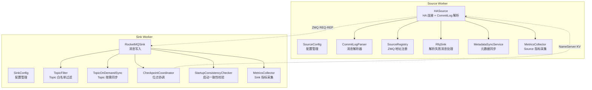
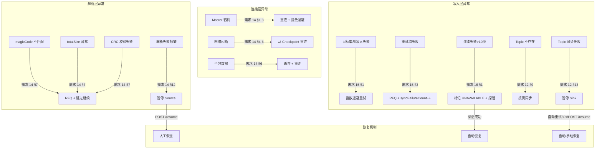
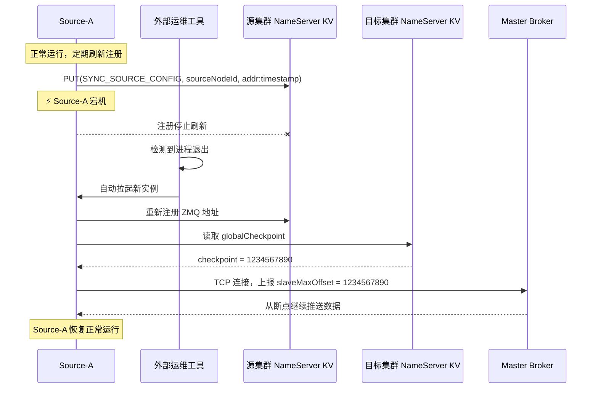

# RocketMQ HA 数据同步组件 — 技术设计文档

> **文档版本**：v2.0 | **最后更新**：2026-03-17 | **作者**：HA Sync Team  
> **关联需求文档**：[requirements.md](doc/ha-data-sync/requirements.md)

---

## 目录

| 章节 | 标题 | 对应需求 |
|------|------|---------|
| 1 | 系统概述 | 引言 |
| 2 | 系统架构 | 需求 2、18 |
| 3 | 配置管理设计 | 需求 1 |
| 4 | 核心组件设计 | 需求 2、3、4、9、12、13 |
| 5 | 关键流程设计 | 需求 5、6、7、8、10、11、17 |
| 6 | 数据模型 | 需求 2、13 |
| 7 | 异常处理设计 | 需求 14、15、16 |
| 8 | 监控指标设计 | 需求 19、20 |
| 9 | 性能优化策略 | 需求 19 |
| 10 | 安全性设计 | 需求 3 |
| 11 | 扩展性设计 | 需求 2 |
| 12 | 测试策略 | — |
| 13 | 部署架构 | — |
| 14 | 运维指南 | 需求 17、20 |
| 附录 | 术语表、参考文档 | — |

---

## 1. 系统概述

### 1.1 设计目标

RocketMQ HA 数据同步组件是一个**独立的 Java 程序**，模拟 RocketMQ Slave Broker 的主从复制行为，从存储层角度实现跨集群数据同步。组件采用 **Source/Sink 分离架构**（类似 Flink Connector），通过 RocketMQ 原生 HA 协议（DefaultHAService 协议）从源集群 Master 拉取 CommitLog 数据，并写入目标 RocketMQ 集群。

> **对应需求**：引言、需求 2

### 1.2 核心特性

| 特性 | 说明 | 对应需求 |
|------|------|---------|
| **Source/Sink 解耦** | Source 专注数据拉取与解析，Sink 专注数据写入，可独立扩展 | 需求 2 |
| **统一 ZMQ 通信** | Source 和 Sink 始终通过 ZeroMQ（REQ-REP）通信，支持独立部署和同进程模式 | 需求 2 §7-13 |
| **完全无状态** | 所有状态（Checkpoint 等）存储在目标集群 NameServer KV 中，可随意迁移替换 | 需求 2 §11-12 |
| **消息顺序严格一致** | 按源集群 CommitLog 物理偏移量（`physicOffset`）严格升序写入目标集群 | 需求 2 §6a-6f |
| **最终一致性** | At-Least-Once 语义 + 启动一致性校验，不丢消息 | 需求 10 |
| **不参与选举** | 仅使用 DefaultHAService 基础 Slave 协议，不影响主从切换 | 需求 3 |
| **高可用** | Master 切换自动重连、断点续传、目标不可写探活 | 需求 8、14、16 |
| **全链路 Trace** | 端到端追踪 + 丰富监控指标 | 需求 19、20 |
| **自动重试** | 网络抖动容错，指数退避重试 | 需求 15 |
| **元数据同步** | 全量元数据 + Topic 按需同步 | 需求 12 |
| **解析失败 RFQ** | 解析失败消息写入源集群 RFQ Topic，不丢原始数据 | 需求 13 |

### 1.3 适用场景

- 跨机房数据同步
- 灾备集群数据复制
- 数据迁移
- 多活架构数据同步

### 1.4 开发阶段映射

| 阶段 | 需求编号 | 本文档对应章节 |
|------|---------|--------------|
| 阶段一：基础骨架 | 需求 1~3 | 第 3、4.1、4.2、10 章 |
| 阶段二：Source 核心 | 需求 4~8 | 第 4.3、5.1~5.5 章 |
| 阶段三：Checkpoint + 最终一致性 | 需求 9~10 | 第 4.5、5.6~5.7 章 |
| 阶段四：Sink 核心 | 需求 11~13 | 第 4.4、4.6、4.7 章 |
| 阶段五：可靠性增强 | 需求 14~17 | 第 7 章 |
| 阶段六：分布式 & 高性能 | 需求 18~19 | 第 9 章 |
| 阶段七：可观测性 | 需求 20 | 第 8 章 |

---

## 2. 系统架构

### 2.1 整体架构

> **对应需求**：需求 2（Source/Sink 架构设计）

```
┌────────────────────────────────────────────────────────────────────────┐
│                  Source Worker（无状态，可多实例）                       │
│                                                                        │
│  ┌───────────────────┐   ZMQ REP Socket      ┌────────────────────┐   │
│  │    HASource        │ ◄─── REQ-REP ─────►  │ Sink（分布式多节点）│   │
│  │  (无状态，可多实例)│   PullReq/PullResp   │ (写入目标 RocketMQ) │   │
│  │                    │                       │                    │   │
│  └───────────────────┘                        └────────────────────┘   │
│          │                                               │             │
│   CheckpointCoordinator（位点协调器）◄────────────────────┘             │
└────────────────────────────────────────────────────────────────────────┘

                    ┌───────────────────────────┐
                    │  源集群 NameServer         │
                    │  (发现 Master HA 地址)     │
                    └─────────────┬─────────────┘
                                  │
                                  ▼
                    ┌───────────────────────────┐
                    │  源集群 Master Broker      │
                    │  (HA 协议，TCP 连接)       │
                    └───────────────────────────┘

                    ┌───────────────────────────┐
                    │  源集群 NameServer KV      │
                    │  - Source 地址注册         │
                    └───────────────────────────┘

                    ┌───────────────────────────┐
                    │  目标集群 NameServer KV    │
                    │  - Checkpoint 存储         │
                    └─────────────┬─────────────┘
                                  │
                                  ▼
                    ┌───────────────────────────┐
                    │  目标集群 RocketMQ         │
                    │  (消息写入 + RFQ)          │
                    └───────────────────────────┘

注意：Source 支持通过 --with-sink 参数在同一进程内嵌启动 Sink 实例，
此时 Sink 通过 localhost:{zmqPort} 连接 Source ZMQ Socket，
通信协议和服务发现逻辑与独立部署完全一致。
```

### 2.2 Source/Sink 部署架构（统一 ZMQ 通信）

> **对应需求**：需求 2 §7-13（Source 与 Sink 通信、ZeroMQ 通信、NameServer KV 服务发现）
> 
> **核心原则**：Source 和 Sink 始终通过 ZMQ REQ-REP 模式通信，无论独立部署还是同进程模式（`--with-sink`），通信协议和服务发现逻辑完全一致。

```
┌──────────────────────────────────────────────────────────────────┐
│                  Source Worker（无状态，可多实例）                 │
│                                                                  │
│  ┌──────────────┐   ┌──────────────┐   ┌───────────────────┐   │
│  │ HA Connection│──►│ CommitLog    │──►│ ZeroMQ REP        │   │
│  │ (Master TCP) │   │ Parser       │   │ Socket (:5555)    │   │
│  └──────────────┘   └──────────────┘   └───────────────────┘   │
│         │                  │                       │            │
│         │           topicBytesStats                 │            │
│         └──► 源集群 NameServer KV 注册 ZMQ 地址 ◄──────────┘            │
│                                                                  │
│  ┌──────────────┐   ┌──────────────┐                            │
│  │ RFQ Sink     │   │ MetadataSync │                            │
│  │ (源集群 RFQ) │   │ Service      │                            │
│  └──────────────┘   └──────────────┘                            │
└──────────────────────────────────────────────────────────────────┘

                              ▲
                              │ ZMQ REQ-REP (PullRequest / PullResponse)
                              ▼

┌──────────────────────────────────────────────────────────────────┐
│                       Sink Worker 1                              │
│                                                                  │
│  ┌──────────────┐   ┌──────────────┐   ┌───────────────────┐   │
│  │ ZeroMQ REQ   │──►│ Topic Filter │──►│ Target RocketMQ   │   │
│  │ Client       │   │ + OnDemand   │   │ Producer          │   │
│  └──────────────┘   │ TopicSync    │   └───────────────────┘   │
│         │           └──────────────┘             │              │
│         └──► NameServer KV 更新 commitOffset ◄───┘              │
│                                                                  │
│  ┌──────────────────────────────────────────────────────────┐   │
│  │ CheckpointCoordinator                                    │   │
│  │  - 管理 commitOffset                                     │   │
│  │  - 异步刷写到 NameServer KV                               │   │
│  └──────────────────────────────────────────────────────────┘   │
└──────────────────────────────────────────────────────────────────┘

┌──────────────────────────────────────────────────────────────────┐
│                       Sink Worker 2 ... N                        │
│  (多个 Sink 并行写入，Source 按 PullRequest 分发数据)             │
└──────────────────────────────────────────────────────────────────┘
```

### 2.3 NameServer KV 数据模型

> **对应需求**：需求 2 §8、§11（Source 地址注册、Checkpoint 存储）
> 
> **注意**：Source 地址注册在**源集群** NameServer KV 中，每个 Source 实例使用自身唯一的 `sourceNodeId` 作为 key，支持多个 Source 实例同时注册。

```
Namespace: SYNC_SOURCE_CONFIG（存储在源集群 NameServer）
├── Key: {sourceNodeId}                          // 每个 Source 实例的唯一标识
└── Value: {host}:{zmqPort}:{timestamp}          // Source ZMQ 地址

Namespace: SYNC_CHECKPOINT（存储在目标集群 NameServer）
├── Key: {brokerName}:globalCheckpoint
│   └── Value: {minOffset}                       // 所有 Sink 的最小 commitOffset
├── Key: {brokerName}:sink:{sinkId}:commitOffset
│   └── Value: {offset}                          // 各 Sink 的已提交位点
└── Key: {brokerName}:source:topicStats
    └── Value: {topic1:bytes,topic2:bytes,...}    // Topic 流量统计
```

### 2.4 组件依赖关系



---

## 3. 配置管理设计

> **对应需求**：需求 1（启动参数配置）

### 3.1 配置优先级模型

```
┌───────────────────────────────────────────────────────────────┐
│  最终生效配置                                                  │
│  ┌─────────────────────────────────────────────────────────┐  │
│  │ 优先级 1（最高）: 环境变量  HA_SOURCE_* / HA_SINK_*     │  │
│  ├─────────────────────────────────────────────────────────┤  │
│  │ 优先级 2（中）  : 命令行参数  --key value               │  │
│  ├─────────────────────────────────────────────────────────┤  │
│  │ 优先级 3（最低）: 配置文件  ha-sync-source/sink.properties │  │
│  ├─────────────────────────────────────────────────────────┤  │
│  │ 兜底默认值                                              │  │
│  └─────────────────────────────────────────────────────────┘  │
└───────────────────────────────────────────────────────────────┘
```

**加载流程**：
1. 加载配置文件（`--configFile` 指定或默认路径）作为基础值
2. 解析命令行参数，覆盖配置文件中的同名项
3. 读取环境变量，覆盖上述所有同名项
4. 空字符串视为未设置，回退到下一优先级
5. 校验必填参数，缺失则打印使用说明并以非零退出码退出

### 3.2 SourceConfig 参数表

#### 必填参数

| 参数 | 环境变量 | 说明 |
|------|---------|------|
| `--sourceNamesrv <addr>` | `HA_SOURCE_SOURCE_NAMESRV` | 源集群 NameServer 地址，多个以 `;` 分隔 |
| `--targetNamesrv <addr>` | `HA_SOURCE_TARGET_NAMESRV` | 目标集群 NameServer 地址 |

#### 可选参数

| 参数 | 环境变量 | 默认值 | 说明 |
|------|---------|--------|------|
| `--sourceMetricsPort <port>` | `HA_SOURCE_SOURCE_METRICS_PORT` | `9876` | Source HTTP 监控端口 |
| `--heartbeatInterval <ms>` | `HA_SOURCE_HEARTBEAT_INTERVAL` | `5000` | 向 Master 上报偏移量间隔 |
| `--masterPollInterval <ms>` | `HA_SOURCE_MASTER_POLL_INTERVAL` | `30000` | 轮询 NameServer 检测 Master 变更间隔 |
| `--checkpointFlushInterval <ms>` | `HA_SOURCE_CHECKPOINT_FLUSH_INTERVAL` | `1000` | Checkpoint 刷写间隔 |
| `--checkpointFlushBatchSize <n>` | `HA_SOURCE_CHECKPOINT_FLUSH_BATCH_SIZE` | `100` | 累计 n 个数据包触发 Checkpoint 刷写 |
| `--sourceNodeId <id>` | `HA_SOURCE_SOURCE_NODE_ID` | `hostname:pid` | Source 节点标识 |
| `--zmqBindPort <port>` | `HA_SOURCE_ZMQ_BIND_PORT` | `5555` | ZeroMQ REP Socket 绑定端口 |
| `--rfqTopic <topic>` | `HA_SOURCE_RFQ_TOPIC` | `ha-sync-rfq` | RFQ 专用 Topic 名称（源集群） |
| `--rfqProducerGroup <group>` | `HA_SOURCE_RFQ_PRODUCER_GROUP` | `ha-sync-rfq-producer` | RFQ Producer Group |
| `--rfqMaxRetry <n>` | `HA_SOURCE_RFQ_MAX_RETRY` | `3` | RFQ 消息发送最大重试次数 |
| `--parseErrorSuspendWindowMs <ms>` | `HA_SOURCE_PARSE_ERROR_SUSPEND_WINDOW_MS` | `60000` | 解析失败暂停检测滑动窗口 |
| `--metaSyncInterval <ms>` | `HA_SOURCE_META_SYNC_INTERVAL` | `60000` | 元数据同步间隔 |
| `--configFile <path>` | — | `./ha-sync-source.properties` | 配置文件路径 |

### 3.3 SinkConfig 参数表

#### 必填参数

| 参数 | 环境变量 | 说明 |
|------|---------|------|
| `--targetNamesrv <addr>` | `HA_SINK_TARGET_NAMESRV` | 目标集群 NameServer 地址 |

#### 可选参数

| 参数 | 环境变量 | 默认值 | 说明 |
|------|---------|--------|------|
| `--sinkMetricsPort <port>` | `HA_SINK_SINK_METRICS_PORT` | `9877` | Sink HTTP 监控端口 |
| `--sinkId <id>` | `HA_SINK_SINK_ID` | `hostname:pid` | Sink 节点唯一标识 |
| `--sinkBatchSize <n>` | `HA_SINK_SINK_BATCH_SIZE` | `100` | 批量发送大小 |
| `--sinkThreads <n>` | `HA_SINK_SINK_THREADS` | `4` | 并发写入线程数 |
| `--sinkMaxRetry <n>` | `HA_SINK_SINK_MAX_RETRY` | `3` | 写入失败最大重试次数 |
| `--targetProbeInterval <ms>` | `HA_SINK_TARGET_PROBE_INTERVAL` | `30000` | 目标集群探活间隔 |
| `--startupCheckMsgCount <n>` | `HA_SINK_STARTUP_CHECK_MSG_COUNT` | `10` | 启动一致性校验消息条数（0=跳过） |
| `--topicSyncMaxRetry <n>` | `HA_SINK_TOPIC_SYNC_MAX_RETRY` | `3` | Topic 按需同步最大重试次数 |
| `--configFile <path>` | — | `./ha-sync-sink.properties` | 配置文件路径 |

### 3.4 配置加载核心类

```java
public abstract class AbstractConfig {
    
    /**
     * 三层配置合并加载
     * @return 配置项与来源的映射
     */
    public Map<String, ConfigEntry> load(String[] args) {
        Map<String, ConfigEntry> result = new LinkedHashMap<>();
        
        // 1. 加载配置文件（最低优先级）
        String configFilePath = extractConfigFilePath(args);
        Properties fileProps = loadPropertiesFile(configFilePath);
        for (String key : fileProps.stringPropertyNames()) {
            if (!isKnownKey(key)) {
                log.warn("未识别的配置项: {}，已忽略", key);
                continue;
            }
            result.put(key, new ConfigEntry(fileProps.getProperty(key), "FILE"));
        }
        
        // 2. 解析命令行参数（中优先级，覆盖配置文件）
        Map<String, String> cliArgs = parseCLI(args);
        for (Map.Entry<String, String> entry : cliArgs.entrySet()) {
            result.put(entry.getKey(), new ConfigEntry(entry.getValue(), "CLI"));
        }
        
        // 3. 读取环境变量（最高优先级，覆盖所有）
        for (String key : getAllConfigKeys()) {
            String envName = toEnvName(key);
            String envValue = System.getenv(envName);
            if (envValue != null && !envValue.isEmpty()) {
                result.put(key, new ConfigEntry(envValue, "ENV"));
            }
        }
        
        // 4. 填充默认值
        for (String key : getAllConfigKeys()) {
            if (!result.containsKey(key) || isBlank(result.get(key).value)) {
                String defaultValue = getDefaultValue(key);
                if (defaultValue != null) {
                    result.put(key, new ConfigEntry(defaultValue, "DEFAULT"));
                }
            }
        }
        
        // 5. 校验必填参数
        validateRequired(result);
        
        // 6. 打印最终生效配置（敏感信息掩码）
        logFinalConfig(result);
        
        return result;
    }
    
    /**
     * 环境变量命名转换
     * Source: sourceNamesrv → HA_SOURCE_SOURCE_NAMESRV
     * Sink:   targetNamesrv → HA_SINK_TARGET_NAMESRV
     */
    protected abstract String toEnvName(String key);
    
    /**
     * 敏感信息掩码（如 NameServer 地址 → 192.168.*.***:9876）
     */
    protected String maskSensitive(String key, String value) {
        if (key.toLowerCase().contains("namesrv")) {
            return value.replaceAll("(\\d+\\.\\d+\\.)\\d+\\.\\d+", "$1*.***");
        }
        return value;
    }
}

public class ConfigEntry {
    String value;   // 配置值
    String source;  // 来源: ENV / CLI / FILE / DEFAULT
}
```

### 3.5 配置文件格式

采用标准 Java Properties 格式（`key=value`），key 与命令行参数名一致（去掉 `--` 前缀）。

**Source 配置文件示例** (`ha-sync-source.properties`)：
```properties
sourceNamesrv=192.168.1.100:9876;192.168.1.101:9876
targetNamesrv=192.168.2.100:9876
sourceMetricsPort=9876
heartbeatInterval=5000
zmqBindPort=5555
rfqTopic=ha-sync-rfq
metaSyncInterval=60000
```

**Sink 配置文件示例** (`ha-sync-sink.properties`)：
```properties
targetNamesrv=192.168.2.100:9876
sinkMetricsPort=9877
sinkId=sink-node-01
sinkBatchSize=200
sinkThreads=8
startupCheckMsgCount=20
topicSyncMaxRetry=3
```

**异常处理**：
- 配置文件不存在 → 忽略，仅使用 CLI 和环境变量
- 配置文件格式错误 → 打印 ERROR 日志并以非零退出码退出
- 未识别的 key → 打印 WARN 日志并忽略

---

## 4. 核心组件设计

### 4.1 SyncSource / SyncSink 接口定义

> **对应需求**：需求 2 §1

```java
/**
 * 数据源接口 — 负责从 Master 拉取数据并产出 SyncRecord
 */
public interface SyncSource {
    void start() throws Exception;
    void stop();
    boolean isRunning();
    
    /**
     * 拉取数据，将解析后的 SyncRecord 放入内部缓冲区
     */
    void poll();
}

/**
 * 数据写入接口 — 负责消费 SyncRecord 并写入目标存储
 */
public interface SyncSink {
    void start() throws Exception;
    void stop();
    
    /**
     * 写入单条记录到目标存储
     */
    void write(SyncRecord record) throws Exception;
    
    /**
     * 批量发送时的刷写逻辑
     */
    void flush() throws Exception;
}

/**
 * 位点协调器接口 — 管理同步位点的读取与推进
 */
public interface CheckpointCoordinator {
    long getConfirmedOffset();
    void commitOffset(String sinkId, long offset);
    long recoverCheckpoint(String sinkId);
    void flush();
}
```

### 4.2 统一通信模型（ZMQ REQ-REP）

> **对应需求**：需求 2 §2、§7-13

> **设计原则**：删除原有的 SyncPipeline 单进程 BlockingQueue 模式。Source 与 Sink 之间**统一**通过 ZeroMQ REQ-REP 模式通信。Source 可通过 `--with-sink` 参数在同一进程内嵌启动 Sink 实例，此时 Sink 通过 `localhost:{zmqPort}` 连接 Source，通信协议和服务发现逻辑与独立部署完全相同，消除维护差异。

#### 4.2.1 通信架构

```
独立部署模式：
  Source Worker (ZMQ REP :5555)  ←── ZMQ REQ ──  Sink Worker 1..N

同进程模式（--with-sink）：
  Source Worker (ZMQ REP :5555)  ←── ZMQ REQ ──  内嵌 Sink（localhost:5555）
  （通信协议完全相同，仅连接地址为 localhost）
```

#### 4.2.2 SourceBootstrap 启动流程

```java
/**
 * Source 进程启动器 — 支持 --with-sink 参数内嵌 Sink
 */
public class SourceBootstrap {
    public static void main(String[] args) {
        SourceConfig config = new SourceConfig();
        config.load(args);
        
        // 1. 创建并启动 HASource（ZMQ REP Socket）
        HASource source = new HASource(config);
        source.start();
        
        // 2. 如果指定了 --with-sink，在同进程内启动 Sink
        if (config.isWithSink()) {
            SinkConfig sinkConfig = buildEmbeddedSinkConfig(config);
            SinkBootstrap.startEmbeddedSink(sinkConfig);
            log.info("内嵌 Sink 已启动，通过 localhost:{} 连接 Source ZMQ", 
                     config.getZmqBindPort());
        }
        
        // 3. 注册 ShutdownHook
        Runtime.getRuntime().addShutdownHook(new Thread(() -> {
            source.stop();
        }));
    }
    
    /**
     * 为内嵌 Sink 构建配置：
     * - targetNamesrv 继承自 Source
     * - Source ZMQ 地址固定为 localhost:{zmqPort}
     */
    private static SinkConfig buildEmbeddedSinkConfig(SourceConfig sourceConfig) {
        SinkConfig sinkConfig = new SinkConfig();
        // Sink 通过 localhost 连接同进程的 Source ZMQ
        // 服务发现和通信逻辑与独立部署完全一致
        return sinkConfig;
    }
}
```

#### 4.2.3 Sink 拉取流程（统一逻辑）

无论 Sink 是独立部署还是内嵌在 Source 进程中，均执行以下流程：

1. 从源集群 NameServer KV 发现 Source ZMQ 地址
2. 通过 ZMQ REQ Socket 连接 Source
3. 发送 PullRequest（含 fromOffset、topicFilter、batchSize、sinkId）
4. 接收 PullResponse（含 records[]、maxOffset、status）
5. 将消息写入目标 RocketMQ 集群
6. 更新 commitOffset 到 NameServer KV

### 4.3 HASource（数据源实现）

> **对应需求**：需求 2 §3、需求 3（不参与选举）、需求 4（动态发现 Master）

#### 4.3.1 职责概述

| 职责 | 说明 | 对应需求 |
|------|------|---------|
| NameServer 发现 | 查询 Master HA 地址（brokerId=0） | 需求 4 |
| HA 协议连接 | 使用 DefaultHAService Slave 协议建立 TCP 连接 | 需求 3 |
| CommitLog 解析 | 解析消息并封装为 SyncRecord | 需求 7 |
| Topic 流量统计 | 统计每个 Topic 的消息字节数 | 需求 18 |
| ZMQ 数据服务 | 通过 ZMQ REP Socket 向 Sink 提供数据 | 需求 2 §7 |
| 地址注册 | 将 ZMQ 地址注册到源集群 NameServer KV | 需求 2 §8 |
| Master 切换 | 检测 Master 变更并自动重连 | 需求 8 |
| RFQ 处理 | 将解析失败的消息写入源集群 RFQ Topic | 需求 13 |
| **不执行** | Topic 过滤、存储写入（属于 Sink 职责） | 需求 2 §3 |

#### 4.3.2 核心类设计

```java
public class HASource implements SyncSource {
    private final SourceConfig config;
    private final HASourceConnection haConnection;
    private final CommitLogParser parser;
    private final SourceRegistry registry;
    private final RfqSink rfqSink;
    private final MetadataSyncService metadataSync;
    private final ZMQ.Context zmqContext;
    private final ZMQ.Socket zmqSocket;         // REP Socket
    private final Map<String, AtomicLong> topicBytesStats;
    private final MetricsCollector metricsCollector;
    private final List<SyncRecord> localBuffer;  // 内存缓冲区
    
    @Override
    public void start() throws Exception {
        // 1. 通过 NameServer 查询 Master HA 地址
        //    → GET_BROKER_CLUSTER_INFO → 选择 brokerId=0
        String masterHaAddr = discoverMasterHaAddr();
        
        // 2. 建立 TCP 连接（仅使用 DefaultHAService 基础 Slave 协议）
        //    → 不发送 HANDSHAKE 包，不携带 slaveAddress
        //    → 不向 NameServer 注册为 Broker
        haConnection.connect(masterHaAddr);
        
        // 3. 启动 ZMQ REP Socket（绑定 --zmqBindPort）
        zmqSocket = zmqContext.socket(ZMQ.REP);
        zmqSocket.bind("tcp://0.0.0.0:" + config.getZmqBindPort());
        
        // 4. 注册到源集群 NameServer KV（每个 Source 实例独立注册）
        //    → namespace: SYNC_SOURCE_CONFIG
        //    → key: {sourceNodeId}（当前 Source 的唯一标识）
        //    → value: {host}:{zmqPort}:{timestamp}
        registry.register();
        
        // 5. 初始化 RFQ Sink（复用 sourceNamesrv 连接）
        rfqSink.start();
        
        // 6. 执行兼容性预校验（需求 5）
        performCompatibilityCheck();
        
        // 7. CommitLog 过期检测（需求 6）
        checkCommitLogExpiry();
        
        // 8. 执行首次全量元数据同步（需求 12 §4）
        metadataSync.syncAll();
        
        // 9. 从 globalCheckpoint 恢复位点，上报初始 slaveMaxOffset
        long checkpoint = checkpointCoordinator.getGlobalCheckpoint();
        haConnection.reportSlaveMaxOffset(checkpoint);
        
        // 10. 启动后台定时任务
        scheduleTask("master-poll", this::pollMasterChange, 30_000);
        scheduleTask("stats-refresh", this::refreshStats, 10_000);
        scheduleTask("registry-refresh", registry::refresh, 30_000);
        scheduleTask("metadata-sync", metadataSync::syncAll, config.getMetaSyncInterval());
    }
    
    @Override
    public void poll() {
        // 1. 从 TCP 连接接收 Master 数据包
        HADataPacket packet = haConnection.receive();
        
        // 2. 解析消息（CommitLogParser）
        List<SyncRecord> records = parser.parse(
            packet.getBody(), packet.getMasterPhyOffset()
        );
        
        // 3. 暂存到本地内存缓冲区
        localBuffer.addAll(records);
        
        // 4. 响应 Sink 的 Pull 请求（ZMQ REP）
        handleZmqPullRequests();
        
        // 5. 上报 slaveMaxOffset（confirmedOffset）
        haConnection.reportSlaveMaxOffset(
            checkpointCoordinator.getGlobalCheckpoint()
        );
    }
    
    /**
     * 处理 Sink 的 ZMQ Pull 请求
     */
    private void handleZmqPullRequests() {
        byte[] request = zmqSocket.recv(ZMQ.DONTWAIT);
        if (request != null) {
            PullRequest pullReq = deserialize(request);
            
            // 从 localBuffer 中按 fromOffset + batchSize 截取
            // records 严格按 physicOffset 升序排列（需求 2 §6b）
            List<SyncRecord> batch = localBuffer.stream()
                .filter(r -> r.getPhysicOffset() >= pullReq.getFromOffset())
                .limit(pullReq.getBatchSize())
                .collect(Collectors.toList());
            
            PullResponse response = new PullResponse(batch, getMaxOffset());
            zmqSocket.send(serialize(response));
        }
    }
    
    @Override
    public void stop() {
        // 1. 关闭 TCP 连接
        haConnection.close();
        // 2. 关闭 ZMQ Socket
        zmqSocket.close();
        zmqContext.close();
        // 3. 关闭 RFQ Sink
        rfqSink.stop();
        // 4. 从源集群 NameServer KV 删除注册（DELETE_KV_CONFIG，key: {sourceNodeId}）
        registry.unregister();
    }
}
```

#### 4.3.3 HA 协议交互流程

> **对应需求**：需求 3（不参与选举约束）

```
Source (伪装 Slave)                         Master
    │                                          │
    ├──────────────► TCP 连接 ────────────────►│
    │   (仅使用 DefaultHAService 基础协议)     │
    │   (不发送 HANDSHAKE 包)                  │
    │   (不携带 slaveAddress)                  │
    │                                          │
    ├──────────────► 上报 slaveMaxOffset ─────►│
    │   (8 字节 confirmedOffset)              │
    │   (上报的是已确认写入目标集群的位点)     │
    │                                          │
    │◄─────────────  数据包 ◄──────────────────┤
    │   [masterPhyOffset(8) + bodySize(4) + body]
    │                                          │
    ├──────────────► 上报新 slaveMaxOffset ───►│
    │   (globalCheckpoint)                    │
    │                                          │
    │◄─────────────  下一个数据包 ◄─────────────┤
    │                                          │
    └────────────────────────────────────────►└──

关键约束：
- 不向 NameServer 注册为 Broker，不发送 Broker 心跳
- 不发送 AutoSwitchHAService 的 HANDSHAKE 包
- 不被纳入 SyncStateSet
- 不向 Controller 发送任何选举相关请求
```

### 4.4 RocketMQSink（数据写入实现）

> **对应需求**：需求 2 §4、需求 11（Topic 过滤）、需求 2 §6a-6f（消息顺序一致性）

#### 4.4.1 职责概述

| 职责 | 说明 | 对应需求 |
|------|------|---------|
| ZMQ 数据拉取 | 通过 ZMQ REQ 从 Source 拉取 SyncRecord | 需求 2 §9-10 |
| Topic 过滤 | 白名单匹配，跳过不需要的 Topic | 需求 11 |
| Topic 按需同步 | 目标集群不存在 Topic 时自动创建 | 需求 12 §9-17 |
| 严格顺序写入 | 按 physicOffset 升序逐条写入 | 需求 2 §6c |
| Queue 路由 | 保持与源集群相同的 queueId | 需求 2 §6d |
| 位点推进 | 写入成功后调用 CheckpointCoordinator | 需求 9 |
| 启动一致性校验 | 校验 Checkpoint 之后 X 条消息的存在性 | 需求 10 §6-11 |

#### 4.4.2 核心类设计

```java
public class RocketMQSink implements SyncSink {
    private final SinkConfig config;
    private final DefaultMQProducer producer;
    private final ZMQ.Socket zmqSocket;         // REQ Socket
    private final CheckpointCoordinator checkpointCoordinator;
    private final Set<String> topicFilter;       // Topic 白名单
    private final Set<String> localTopicCache;   // 目标集群已存在 Topic 缓存
    private final TopicOnDemandSync topicOnDemandSync;
    private final MetricsCollector metricsCollector;
    private volatile String syncStatus = "RUNNING";  // RUNNING / TOPIC_SYNC_SUSPENDED
    
    @Override
    public void start() throws Exception {
        // 1. 从源集群 NameServer KV 查询 Source ZMQ 地址列表
        //    → GET_KV_LIST(SYNC_SOURCE_CONFIG)，遍历所有已注册的 Source
        String sourceAddr = discoverSourceAddr();
        
        // 2. 连接 Source 的 ZMQ REP Socket
        zmqSocket = zmqContext.socket(ZMQ.REQ);
        zmqSocket.connect("tcp://" + sourceAddr);
        
        // 3. 初始化 RocketMQ Producer（目标集群）
        producer.setNamesrvAddr(config.getTargetNamesrv());
        producer.start();
        
        // 4. 从 NameServer KV 恢复 Checkpoint
        //    → Key: {brokerName}:sink:{sinkId}:commitOffset
        long commitOffset = checkpointCoordinator.recoverCheckpoint(config.getSinkId());
        
        // 5. 启动一致性校验（需求 10 §6-11）
        if (config.getStartupCheckMsgCount() > 0 && commitOffset > 0) {
            performStartupConsistencyCheck(commitOffset);
        }
        
        // 6. 初始化本地 Topic 缓存
        //    → 查询目标集群已存在的全部 Topic 列表
        localTopicCache.addAll(queryTargetTopicList());
        
        // 7. 进入 Pull 循环
        startPullLoop();
    }
    
    @Override
    public void write(SyncRecord record) throws Exception {
        // 1. Topic 过滤（白名单匹配）— 需求 11
        if (!topicFilter.isEmpty() && !topicFilter.contains(record.getTopic())) {
            metricsCollector.incrementFilteredMessageCount();
            return;  // 跳过，但仍推进 confirmedOffset
        }
        
        // 2. Topic 按需同步（需求 12 §9-17）
        if (!localTopicCache.contains(record.getTopic())) {
            if (!topicOnDemandSync.ensureTopicExists(record.getTopic())) {
                // 同步失败，Sink 暂停
                return;
            }
        }
        
        // 3. 严格按 physicOffset 顺序写入（需求 2 §6c）
        //    使用 FixedQueueSelector 保持源集群 queueId（需求 2 §6d）
        Message message = buildMessage(record);
        
        // 保留 ORIGIN_PHYSICAL_OFFSET 属性（需求 7 §5）
        message.putUserProperty("ORIGIN_PHYSICAL_OFFSET", 
            String.valueOf(record.getPhysicOffset()));
        
        // 保留 SYNC_TRACE_ID 属性（需求 19 §2）
        message.putUserProperty("SYNC_TRACE_ID", record.getTraceId());
        
        // 4. 同步发送（写入失败需阻塞后续消息 — 需求 2 §6f）
        SendResult result = producer.send(
            message,
            new FixedQueueSelector(),
            record.getQueueId()
        );
        
        // 5. 写入成功后更新 commitOffset
        checkpointCoordinator.commitOffset(config.getSinkId(), record.getEndOffset());
        metricsCollector.incrementSyncSuccessCount();
        
        // 6. 记录 Trace 事件 SINK_WRITTEN（需求 19 §4）
        traceLogger.logSinkWritten(record.getTraceId(), result.getMsgId(),
            System.currentTimeMillis(), 
            System.currentTimeMillis() - record.getReceiveTimestamp());
    }
    
    @Override
    public void stop() {
        // 1. 等待队列中的消息全部写入
        // 2. 刷写最后一次 Checkpoint
        checkpointCoordinator.flush();
        // 3. 关闭 Producer
        producer.shutdown();
        // 4. 关闭 ZMQ Socket
        zmqSocket.close();
    }
}
```

#### 4.4.3 消息顺序一致性保证

> **对应需求**：需求 2 §6a-6f（消息顺序严格一致性保证）

```java
/**
 * 固定 Queue 选择器 — 保持与源集群相同的 queueId
 * 保证：对于源集群 Topic T 的 Queue Q 上的消息序列 [M1, M2, M3, ...]
 *       目标集群 Topic T 的 Queue Q 上的消息顺序也为 [M1, M2, M3, ...]
 */
public class FixedQueueSelector implements MessageQueueSelector {
    @Override
    public MessageQueue select(List<MessageQueue> mqs, Message msg, Object arg) {
        int queueId = (Integer) arg;
        return mqs.stream()
            .filter(mq -> mq.getQueueId() == queueId)
            .findFirst()
            .orElseThrow(() -> new IllegalStateException(
                "Queue not found: " + queueId));
    }
}

/*
 * 顺序保证链路：
 * 
 * 1. Source 按 physicOffset 顺序产出 SyncRecord（需求 2 §6a）
 *    → CommitLogParser 严格按 CommitLog 物理偏移量顺序解析
 * 
 * 2. PullResponse.records[] 严格按 physicOffset 升序排列（需求 2 §6b）
 *    → Source 响应 Pull 时保持顺序
 * 
 * 3. Sink 严格按 physicOffset 升序逐条写入（需求 2 §6c）
 *    → 当前消息写入成功并确认后才能写入下一条
 *    → 禁止并行写入或乱序写入
 * 
 * 4. FixedQueueSelector 保持相同 queueId（需求 2 §6d）
 *    → 同一 Topic 同一 Queue 内消息顺序一致
 * 
 * 5. 写入失败重试时阻塞后续消息（需求 2 §6f）
 *    → 确保不因重试导致乱序
 */
```

### 4.5 CheckpointCoordinator（位点协调器实现）

> **对应需求**：需求 9（Checkpoint 断点续传）、需求 10 §1-5（At-Least-Once）

#### 4.5.1 核心设计原则

```
写入顺序保证（需求 10 §1）：
  ① 先写数据到目标集群
  ② 确认写入成功
  ③ 最后推进 Checkpoint
  → 确保 confirmedOffset 仅代表已成功写入目标集群的数据
  → 上报 Master 的 slaveMaxOffset 使用 confirmedOffset（需求 10 §5）
```

#### 4.5.2 核心类设计

```java
public class CheckpointCoordinatorImpl implements CheckpointCoordinator {
    private final MQClientAPIImpl mqClientAPI;
    private final String brokerName;
    private volatile long globalCheckpoint;
    private final ConcurrentMap<String, Long> sinkCommitOffsets;
    private volatile long lastFlushTime;
    private final AtomicInteger pendingPacketCount = new AtomicInteger(0);
    private final ScheduledExecutorService scheduler;
    
    /**
     * Sink 写入成功后调用（需求 10 §1 — 先写数据、确认成功、再推进位点）
     */
    @Override
    public void commitOffset(String sinkId, long offset) {
        sinkCommitOffsets.put(sinkId, offset);
        pendingPacketCount.incrementAndGet();
        
        // 异步刷写到 NameServer KV
        if (shouldFlush()) {
            scheduleFlush();
        }
    }
    
    /**
     * 计算 globalCheckpoint = min(所有 Sink 的 commitOffset)
     * Source 定期调用，用于上报 Master 的 slaveMaxOffset
     */
    public long getGlobalCheckpoint() {
        long minOffset = sinkCommitOffsets.values().stream()
            .min(Long::compare)
            .orElse(0L);
        
        globalCheckpoint = minOffset;
        persistGlobalCheckpoint(globalCheckpoint);
        return globalCheckpoint;
    }
    
    /**
     * 启动时从 NameServer KV 恢复位点（需求 2 §12）
     */
    @Override
    public long recoverCheckpoint(String sinkId) {
        String key = brokerName + ":sink:" + sinkId + ":commitOffset";
        String value = mqClientAPI.getKVConfig("SYNC_CHECKPOINT", key);
        return value != null ? Long.parseLong(value) : 0L;
    }
    
    /**
     * 优雅停机时强制刷写（需求 17 §1）
     */
    @Override
    public void flush() {
        doFlush();  // 同步刷写
    }
    
    /**
     * Checkpoint 刷写策略（需求 9 §3）
     * 触发条件（任一满足即触发）：
     *   1. 累计新增数据包达到 checkpointFlushBatchSize（默认 100）
     *   2. 距上次刷写超过 checkpointFlushInterval（默认 1000ms）
     *   3. 优雅停机时强制刷写
     */
    private boolean shouldFlush() {
        return pendingPacketCount.get() >= config.getCheckpointFlushBatchSize()
            || System.currentTimeMillis() - lastFlushTime >= config.getCheckpointFlushInterval();
    }
    
    private void doFlush() {
        try {
            // 批量写入所有 Sink 的 commitOffset 到 NameServer KV
            for (Map.Entry<String, Long> entry : sinkCommitOffsets.entrySet()) {
                String key = brokerName + ":sink:" + entry.getKey() + ":commitOffset";
                mqClientAPI.putKVConfig("SYNC_CHECKPOINT", key,
                    String.valueOf(entry.getValue()));
            }
            
            // 写入 globalCheckpoint
            persistGlobalCheckpoint(getGlobalCheckpoint());
            
            lastFlushTime = System.currentTimeMillis();
            pendingPacketCount.set(0);
        } catch (Exception e) {
            log.error("Checkpoint flush failed", e);
            metricsCollector.incrementCheckpointFlushError();
        }
    }
}
```

### 4.6 CommitLogParser（消息解析器）

> **对应需求**：需求 7（消息完整性与顺序）

#### 4.6.1 消息格式

```
CommitLog 数据包格式：
┌────────────────────────────────────────────────┐
│  masterPhyOffset (8 bytes)                     │  ← 数据包起始偏移量
├────────────────────────────────────────────────┤
│  bodySize (4 bytes)                            │  ← body 长度
├────────────────────────────────────────────────┤
│  body (variable length)                        │
│    ├─ Message 1 (totalSize, magicCode, ...)   │
│    ├─ Message 2                                │
│    └─ Message N                                │
└────────────────────────────────────────────────┘

单条消息完整性校验项（需求 7 §1）：
┌────────────────────────────────────────────────┐
│  totalSize (4B)     → > 20B 且 ≤ 4MB           │
│  magicCode (4B)     → 0xAABBCCDD 或 V2         │
│  bodyCRC (4B)       → CRC32 校验               │
│  queueId (4B)       → 队列 ID                  │
│  ...                                           │
│  topic (variable)   → Topic 名称               │
│  body (variable)    → 消息体                    │
└────────────────────────────────────────────────┘
```

#### 4.6.2 解析流程

```java
public class CommitLogParser {
    private final Map<String, AtomicLong> topicBytesStats;
    private final MetricsCollector metricsCollector;
    private final RfqSink rfqSink;
    
    /**
     * 解析 CommitLog 数据包，严格按物理偏移量顺序产出 SyncRecord
     * （需求 2 §6a — 不得乱序、跳跃或并行产出）
     */
    public List<SyncRecord> parse(byte[] data, long masterPhyOffset) {
        List<SyncRecord> records = new ArrayList<>();
        ByteBuffer buffer = ByteBuffer.wrap(data);
        long currentOffset = masterPhyOffset;
        int totalMessages = 0;
        int failedMessages = 0;
        
        while (buffer.hasRemaining()) {
            int posBeforeMsg = buffer.position();
            totalMessages++;
            
            try {
                // 1. 读取 totalSize
                int totalSize = buffer.getInt();
                
                // totalSize 校验（需求 7 §1）
                if (totalSize < 20 || totalSize > 4 * 1024 * 1024) {
                    throw new ParseException("Invalid totalSize: " + totalSize);
                }
                
                // 2. 校验 magicCode（需求 7 §1）
                int magicCode = buffer.getInt();
                if (magicCode != MESSAGE_MAGIC_CODE && magicCode != MESSAGE_MAGIC_CODE_V2) {
                    throw new ParseException("Invalid magicCode: 0x" 
                        + Integer.toHexString(magicCode));
                }
                
                // 3. 解析消息头
                int bodyCRC = buffer.getInt();
                int queueId = buffer.getInt();
                // ... 其他字段
                
                // 4. 读取 topic
                int topicLength = buffer.get();
                byte[] topicBytes = new byte[topicLength];
                buffer.get(topicBytes);
                String topic = new String(topicBytes, StandardCharsets.UTF_8);
                
                // 5. 读取 body
                int bodyLength = totalSize - HEADER_SIZE - topicLength;
                byte[] body = new byte[bodyLength];
                buffer.get(body);
                
                // 实际读取长度校验（需求 7 §1）
                int actualReadSize = buffer.position() - posBeforeMsg;
                if (actualReadSize != totalSize) {
                    throw new ParseException("Truncated message: expected " 
                        + totalSize + ", actual " + actualReadSize);
                }
                
                // 6. bodyCRC 校验（需求 7 §1）
                if (!validateCRC(body, bodyCRC)) {
                    throw new ParseException("CRC mismatch at offset " + currentOffset);
                }
                
                // 7. 生成 Trace ID（需求 19 §1）
                String traceId = config.getSourceNodeId() + "-" 
                    + masterPhyOffset + "-" + (currentOffset - masterPhyOffset);
                
                // 8. 封装 SyncRecord（需求 7 §4）
                SyncRecord record = new SyncRecord();
                record.setMasterPhyOffset(masterPhyOffset);
                record.setEndOffset(currentOffset + totalSize);
                record.setPhysicOffset(currentOffset);  // 绝对顺序依据
                record.setTopic(topic);
                record.setQueueId(queueId);
                record.setBody(body);
                record.setMsgSize(totalSize);
                record.setStoreTimestamp(System.currentTimeMillis());
                record.setReceiveTimestamp(System.currentTimeMillis());
                record.setTraceId(traceId);
                
                records.add(record);
                
                // 统计 Topic 流量（需求 18 §4）
                topicBytesStats.computeIfAbsent(topic, k -> new AtomicLong())
                    .addAndGet(totalSize);
                
                // 记录 Trace 事件 SOURCE_PARSED（需求 19 §3）
                traceLogger.logSourceParsed(traceId, masterPhyOffset, 
                    topic, totalSize, System.currentTimeMillis());
                
            } catch (ParseException e) {
                failedMessages++;
                handleParseError(data, posBeforeMsg, currentOffset, 
                    masterPhyOffset, e.getMessage());
            }
            
            currentOffset += getMessageSize(buffer, posBeforeMsg);
        }
        
        // 单个数据包解析失败超过 50% 告警（需求 14 §8）
        if (totalMessages > 0 && failedMessages > totalMessages * 0.5) {
            log.warn("数据包可能存在严重损坏: 总消息数={}, 失败数={}", 
                totalMessages, failedMessages);
            metricsCollector.incrementSyncFailureCount();
        }
        
        return records;
    }
    
    /**
     * 解析失败处理（需求 14 §7 + 需求 13）
     * 记录日志 → 封装 ReplicaFailRecord → 写入 RFQ → 跳过继续
     */
    private void handleParseError(byte[] rawData, int posInPacket, 
            long currentOffset, long masterPhyOffset, String reason) {
        log.error("Parse error at offset {}: {}", currentOffset, reason);
        metricsCollector.incrementParseError();
        
        // 封装为 ReplicaFailRecord 发送到源集群 RFQ（需求 13 §5-6）
        ReplicaFailRecord failRecord = new ReplicaFailRecord();
        failRecord.setRawBytes(extractRawBytes(rawData, posInPacket));
        failRecord.setMasterPhyOffset(masterPhyOffset);
        failRecord.setOffsetInPacket(posInPacket);
        failRecord.setErrorReason(ErrorReason.fromMessage(reason));
        failRecord.setFailTimestamp(Instant.now().toString());
        failRecord.setSourceCluster(config.getSourceNamesrv());
        
        rfqSink.send(failRecord);
        
        // 记录 Trace 事件 FAILED（需求 19 §5）
        traceLogger.logFailed(null, "SOURCE", reason, System.currentTimeMillis());
    }
}
```

### 4.7 MetadataSyncService（元数据同步）

> **对应需求**：需求 12（全量元数据同步）

#### 4.7.1 同步范围

| 元数据类型 | 源接口 | 目标接口 | 同步频率 | 增量策略 |
|-----------|--------|---------|---------|---------|
| Topic 配置 | `GET_ALL_TOPIC_CONFIG` | `UPDATE_AND_CREATE_TOPIC` | 启动 + 每 60s | DataVersion 比较 |
| 消费者位点 | `GET_ALL_CONSUMER_OFFSET` | `UPDATE_CONSUMER_OFFSET` | 每 60s | DataVersion 比较 |
| 延迟消息位点 | `GET_ALL_DELAY_OFFSET` | 文件写入 | 每 60s | DataVersion 比较 |
| 订阅组配置 | `GET_ALL_SUBSCRIPTIONGROUP_CONFIG` | `UPDATE_SUBSCRIPTIONGROUP_CONFIG` | 每 60s | DataVersion 比较 |
| 消息请求模式 | `GET_ALL_MESSAGE_REQUEST_MODE` | `UPDATE_MESSAGE_REQUEST_MODE` | 每 60s | DataVersion 比较 |
| 定时消息指标 | `GET_TIMER_METRICS` | 指标写入 | 每 60s（仅 timerWheelEnable=true） | 全量 |

#### 4.7.2 Topic 按需同步

> **对应需求**：需求 12 §9-17

```java
public class TopicOnDemandSync {
    private final SinkConfig config;
    private final DefaultMQAdminExt adminExt;
    private final Set<String> localTopicCache;
    private final MetricsCollector metricsCollector;
    
    /**
     * Sink 写入前检查 Topic 是否存在，不存在则按需同步（需求 12 §9）
     * @return true=Topic 已就绪，false=同步失败（Sink 应暂停）
     */
    public boolean ensureTopicExists(String topic) {
        // 1. 检查本地缓存（需求 12 §16）
        if (localTopicCache.contains(topic)) {
            return true;
        }
        
        metricsCollector.incrementTopicSyncOnDemandCount();
        
        // 2. 从源集群查询完整 TopicConfig（需求 12 §10）
        TopicConfig sourceConfig = adminExt.examineTopicConfig(
            sourceNameSrv, topic);
        
        // 3. 在目标集群创建 Topic（配置完全一致）
        try {
            adminExt.createAndUpdateTopicConfig(targetNameSrv, sourceConfig);
            localTopicCache.add(topic);
            log.info("Topic [{}] 在目标集群不存在，已从源集群同步创建成功", topic);
            return true;
        } catch (Exception e) {
            return retryTopicSync(topic, sourceConfig);
        }
    }
    
    /**
     * 指数退避重试（需求 12 §12）
     * 初始间隔 500ms，最大间隔 5s，最多重试 topicSyncMaxRetry 次
     */
    private boolean retryTopicSync(String topic, TopicConfig config) {
        int maxRetry = this.config.getTopicSyncMaxRetry();
        
        for (int i = 0; i < maxRetry; i++) {
            try {
                Thread.sleep(Math.min(500 * (1 << i), 5000));
                adminExt.createAndUpdateTopicConfig(targetNameSrv, config);
                localTopicCache.add(topic);
                return true;
            } catch (Exception e) {
                log.warn("Retry {}/{} failed for topic [{}]", i+1, maxRetry, topic);
            }
        }
        
        // 重试均失败 → 暂停整个 Sink（需求 12 §13）
        metricsCollector.incrementTopicSyncFailureCount();
        metricsCollector.setTopicSyncSuspended(true, topic);
        log.error("Topic [{}] 同步到目标集群失败，同步已暂停", topic);
        
        // 启动自动恢复任务（需求 12 §14 — 每 30 秒重试一次）
        scheduleAutoRecovery(topic, config);
        
        return false;
    }
}
```

### 4.8 RfqSink（解析失败消息处理）

> **对应需求**：需求 13（解析失败 RFQ）

```java
/**
 * 将解析失败的消息写入源集群 RFQ Topic
 * 始终启用，无需额外开关（需求 13 §1）
 */
public class RfqSink {
    private final SourceConfig config;
    private final DefaultMQProducer producer;  // 复用源集群连接（需求 13 §10）
    private final String rfqTopic;
    private final Path fallbackFile;            // 本地备用文件
    
    public void start() {
        producer.setProducerGroup(config.getRfqProducerGroup());
        producer.setNamesrvAddr(config.getSourceNamesrv());
        try {
            producer.start();
        } catch (Exception e) {
            // 连接失败不阻止主同步流程（需求 13 §10）
            log.error("RFQ Producer 启动失败，消息将暂时写入本地备用文件", e);
        }
    }
    
    /**
     * 发送 ReplicaFailRecord 到源集群 RFQ Topic（需求 13 §6-9）
     */
    public void send(ReplicaFailRecord record) {
        Message message = new Message(rfqTopic, JSON.toJSONBytes(record));
        
        // 设置消息属性（需求 13 §7）
        message.putUserProperty("MASTER_PHY_OFFSET", 
            String.valueOf(record.getMasterPhyOffset()));
        message.putUserProperty("ERROR_REASON", record.getErrorReason().name());
        message.putUserProperty("SOURCE_CLUSTER", record.getSourceCluster());
        message.putUserProperty("FAIL_TIMESTAMP", record.getFailTimestamp());
        
        // 同步发送 + 指数退避重试（需求 13 §8-9）
        boolean sent = false;
        for (int i = 0; i <= config.getRfqMaxRetry(); i++) {
            try {
                if (i > 0) Thread.sleep(500 * (1 << (i - 1)));
                producer.send(message);  // 同步发送
                metricsCollector.incrementRfqSendSuccessCount();
                sent = true;
                break;
            } catch (Exception e) {
                log.warn("RFQ send retry {}/{} failed", i, config.getRfqMaxRetry());
            }
        }
        
        // 重试均失败 → 写入本地备用文件（需求 13 §9）
        if (!sent) {
            metricsCollector.incrementRfqSendFailureCount();
            metricsCollector.incrementRfqFallbackCount();
            writeFallback(record);
        }
    }
    
    /**
     * 本地备用文件写入（rfq-fallback.jsonl，追加写入）
     */
    private void writeFallback(ReplicaFailRecord record) {
        try (FileWriter fw = new FileWriter(fallbackFile.toFile(), true)) {
            fw.write(JSON.toJSONString(record) + "\n");
        } catch (IOException e) {
            log.error("RFQ fallback 文件写入失败", e);
        }
    }
}
```

---

## 5. 关键流程设计

### 5.1 Source 启动流程

> **对应需求**：需求 1、4、5、6、12 §4

```
┌──────────────────────────────────────────────────────────────────┐
│                      Source 启动流程                              │
└──────────────────────────────────────────────────────────────────┘

 1. 加载配置（环境变量 > CLI > 配置文件 > 默认值）
    └─ SourceConfig.load()，打印最终生效配置及来源

 2. 解析源集群 NameServer 地址（--sourceNamesrv）

 3. 通过 NameServer 查询 Master HA 地址（需求 4）
    └─ GET_BROKER_CLUSTER_INFO → 选择 brokerId=0
    └─ 失败则按指数退避重试（初始 1s，最大 30s）

 4. 建立 TCP 连接（Master HA 地址）
    └─ 仅使用 DefaultHAService 基础 Slave 协议（需求 3）
    └─ 不发送 HANDSHAKE 包，不向 NameServer 注册为 Broker

 5. 兼容性预校验（需求 5）
    ├─ 拉取少量 CommitLog 数据（至少 1 条消息，最多 1MB）
    ├─ 尝试解析（校验 magicCode、totalSize、bodyCRC）
    ├─ 成功 → INFO 日志，继续
    ├─ Master CommitLog 为空 → WARN 日志，跳过校验
    └─ 失败 → ERROR 日志（含 Master 地址、偏移量范围、失败字段对比），
              立即以非零退出码退出

 6. CommitLog 过期检测（需求 6）
    ├─ 查询 Master minPhyOffset / maxPhyOffset
    ├─ confirmedOffset >= minPhyOffset → 正常从 confirmedOffset 开始
    ├─ confirmedOffset < minPhyOffset → ERROR 日志，阻塞启动
    │   ├─ HA_SOURCE_RESET_TO_EARLIEST=true → WARN 日志，从 minPhyOffset 开始
    │   └─ 否则等待人工确认
    └─ 运行期间 confirmedOffset < minPhyOffset → ERROR 日志 + 告警（不中断）

 7. 启动 ZMQ REP Socket（绑定 --zmqBindPort，默认 5555）

 8. 注册到源集群 NameServer KV（每个 Source 实例独立注册，需求 2 §8）
    └─ Namespace: SYNC_SOURCE_CONFIG
        Key: {sourceNodeId}
        Value: {host}:{zmqPort}:{timestamp}

 9. 初始化 RFQ Sink（复用 sourceNamesrv 连接）

10. 执行首次全量元数据同步（需求 12 §4）
    └─ 在 CommitLog 同步前完成

11. 从 globalCheckpoint 恢复位点
    └─ 从目标集群 NameServer KV 读取
    └─ 上报初始 slaveMaxOffset

12. 启动后台定时任务
    ├─ Master 地址轮询（默认 30s）── 需求 8 §5
    ├─ Topic 流量统计刷新（10s）── 需求 18 §5
    ├─ Source 地址注册刷新（30s）── 需求 2 §8
    ├─ 元数据同步（默认 60s）── 需求 12 §5
    └─ Checkpoint 刷写（1s / 100 条）── 需求 9 §3

13. 进入数据接收循环
```

### 5.2 Sink 启动流程

> **对应需求**：需求 1、2 §9、10 §6-11、12 §16

```
┌──────────────────────────────────────────────────────────────────┐
│                      Sink 启动流程                                │
└──────────────────────────────────────────────────────────────────┘

 1. 加载配置（环境变量 > CLI > 配置文件 > 默认值）
    └─ SinkConfig.load()，打印最终生效配置及来源

 2. 从源集群 NameServer KV 查询 Source ZMQ 地址列表（需求 2 §9）
    └─ GET_KV_LIST(SYNC_SOURCE_CONFIG)，遍历所有已注册的 Source 实例

 3. 连接 Source 的 ZMQ REP Socket（ZMQ REQ）

 4. 初始化 RocketMQ Producer（目标集群）

 5. 从 NameServer KV 恢复 Checkpoint（需求 2 §12）
    └─ Key: {brokerName}:sink:{sinkId}:commitOffset

 6. 启动一致性校验（需求 10 §6-11，可选）
    ├─ startupCheckMsgCount == 0 → 跳过
    ├─ confirmedOffset == 0（首次启动）→ 跳过
    ├─ 从 confirmedOffset 后读取 X 条消息
    ├─ 通过 ORIGIN_PHYSICAL_OFFSET 在目标集群查询匹配
    ├─ 全部存在 → INFO 日志，跳过这 X 条，从第 X+1 条开始
    └─ 存在缺失 → WARN 日志，从 confirmedOffset 重新同步

 7. 初始化本地 Topic 缓存（需求 12 §16）
    └─ 查询目标集群已存在的全部 Topic 列表

 8. 启动后台定时任务
    └─ 快照写入（60s）── 需求 17 §3

 9. 进入 Pull 循环（ZMQ REQ 拉取 SyncRecord）
```

### 5.3 数据同步流程

> **对应需求**：需求 2 §6a-6f、需求 7、需求 9、需求 11

```
Source                                              Sink
  │                                                  │
  ├─► 接收 Master 数据包                             │
  │   [masterPhyOffset(8) + bodySize(4) + body]     │
  │                                                  │
  ├─► CommitLogParser 解析                           │
  │   ├─ magicCode 校验（需求 7 §1）                 │
  │   ├─ totalSize 校验（>20B, ≤4MB）               │
  │   ├─ bodyCRC 校验                                │
  │   ├─ 解析消息头（topic, queueId, body）          │
  │   ├─ 生成 traceId（需求 19 §1）                  │
  │   ├─ 统计 Topic 流量（需求 18 §4）               │
  │   ├─ 解析失败 → RFQ（需求 13）                   │
  │   └─ 严格按 physicOffset 顺序封装 SyncRecord     │
  │      （需求 2 §6a）                              │
  │                                                  │
  ├─► 暂存 SyncRecord（内存缓冲区）                  │
  │                                                  │
  │                  ZMQ REQ-REP                     │
  │◄───────────────── PullRequest ◄──────────────────┤
  │   {fromOffset, topicFilter, batchSize, sinkId}  │
  │                                                  │
  ├────────────────► PullResponse ──────────────────►│
  │   {records[] 按 physicOffset 升序, maxOffset}    │
  │   （需求 2 §6b）                                 │
  │                                                  │
  │                                                  ├─► Topic 过滤（白名单）
  │                                                  │   └─ 不在白名单 → 跳过
  │                                                  │      filteredMessageCount++
  │                                                  │      （需求 11）
  │                                                  │
  │                                                  ├─► Topic 按需同步
  │                                                  │   └─ 不存在 → 从源集群同步
  │                                                  │      失败 → 暂停 Sink
  │                                                  │      （需求 12 §9-17）
  │                                                  │
  │                                                  ├─► 严格按 physicOffset 顺序写入
  │                                                  │   ├─ FixedQueueSelector 保持 queueId
  │                                                  │   ├─ 保留 ORIGIN_PHYSICAL_OFFSET
  │                                                  │   ├─ 保留 SYNC_TRACE_ID
  │                                                  │   └─ 写入失败重试时阻塞后续消息
  │                                                  │      （需求 2 §6c-6f）
  │                                                  │
  │                                                  ├─► 写入成功 → commitOffset()
  │                                                  │   └─ 先写数据、确认成功、再推进
  │                                                  │      （需求 10 §1）
  │                                                  │
  │                                                  ├─► 异步 Checkpoint 到 NameServer KV
  │                                                  │   Key: {brokerName}:sink:{sinkId}:commitOffset
  │                                                  │   （需求 9 §3 触发条件）
  │                                                  │
  │                                                  └─► 下一轮 Pull
  │                                                  │
  ├─► 定期计算 globalCheckpoint                      │
  │   └─ min(所有 Sink 的 commitOffset)              │
  │                                                  │
  ├─► 上报 globalCheckpoint 给 Master                │
  │   └─ 8 字节 slaveMaxOffset（confirmedOffset）    │
  │      （需求 10 §5）                              │
  └──────────────────────────────────────────────────┘
```

### 5.4 Master 切换流程

> **对应需求**：需求 8（Master 切换重连）

```
1. HASource 检测到 TCP 连接断开
   └─ IOException / SocketException

2. 触发重连流程
   ├─ 关闭旧连接
   ├─ 清理本地缓冲区
   └─ 重置接收状态

3. 向 NameServer 查询新的 Master HA 地址
   └─ GET_BROKER_CLUSTER_INFO → 选择 brokerId=0

4. 对比新旧 Master 地址
   ├─ 地址不同 → Master 切换
   │   ├─ masterSwitchCount++（需求 20 §1）
   │   └─ 日志记录旧地址、新地址、切换时间（需求 8 §2）
   └─ 地址相同 → Master 重启

5. 从 CheckpointCoordinator 读取 globalCheckpoint

6. 建立新 TCP 连接

7. 上报 globalCheckpoint 作为 slaveMaxOffset（需求 8 §4）
   └─ 从断点处继续拉取

8. 重连失败处理（需求 8 §3 + 需求 14 §1-3）
   ├─ 指数退避重试（1s, 2s, 4s, ..., 最大 30s）
   ├─ retryCount++
   ├─ 超过 10 分钟仍失败 → ERROR 级别告警
   └─ 不退出进程，持续重试
```

### 5.5 兼容性预校验流程

> **对应需求**：需求 5

```
┌──────────────────────────────────────────────────────────────────┐
│                    兼容性预校验流程                                │
└──────────────────────────────────────────────────────────────────┘

1. 连接 Master 成功后，在正式同步前执行

2. 查询 Master maxPhyOffset
   └─ IF maxPhyOffset == 0 → WARN 日志（"Master CommitLog 为空"），跳过

3. 拉取少量 CommitLog 数据（至少 1 条完整消息，最多 1MB）

4. 尝试解析拉取到的消息
   ├─ 校验 magicCode
   ├─ 校验 totalSize
   └─ 校验 bodyCRC

5. 解析结果
   ├─ 成功 → INFO 日志（"兼容性预校验成功，消息格式兼容"），继续
   └─ 失败 → ERROR 日志（含完整错误信息）
              ├─ Master 地址
              ├─ 拉取的偏移量范围
              ├─ 解析失败的具体字段
              ├─ 期望值/实际值对比
              └─ 立即以非零退出码退出（不等待人工确认）
```

### 5.6 启动一致性校验流程

> **对应需求**：需求 10 §6-11

```
┌──────────────────────────────────────────────────────────────────┐
│                    启动一致性校验流程（Sink 侧）                  │
└──────────────────────────────────────────────────────────────────┘

前置条件：
  - startupCheckMsgCount > 0（否则跳过，需求 10 §10）
  - confirmedOffset > 0（否则跳过，需求 10 §11）

1. 从 confirmedOffset 之后读取连续 X 条消息

2. 逐一检查每条消息是否已存在于目标集群
   └─ 通过 ORIGIN_PHYSICAL_OFFSET 属性匹配（需求 10 §7）

3. 校验结果
   ├─ 全部 X 条存在 → INFO 日志
   │   └─ 跳过这 X 条，从第 X+1 条的偏移量开始同步（需求 10 §8）
   │   └─ metricsCollector.setStartupCheckResult("PASSED")
   │   └─ startupCheckMsgFound = X
   │
   └─ 存在缺失（第 N 条不存在）→ WARN 日志
       └─ 从 confirmedOffset 重新同步（需求 10 §9）
       └─ 允许少量重复消息
       └─ metricsCollector.setStartupCheckResult("FAILED")
       └─ startupCheckMsgFound = N - 1
```

### 5.7 优雅停机流程

> **对应需求**：需求 17（优雅停机快照）、需求 1 §14

```
1. 接收到 SIGTERM / SIGINT 信号

2. 停止 HASource 拉取新数据
   └─ 关闭 TCP 连接

3. 等待 Pipeline 队列中的 SyncRecord 全部被 Sink 处理
   └─ 最长等待 30 秒
   └─ 超时 → WARN 日志，强制停止（需求 17 §2）

4. Sink 刷写最后一次 Checkpoint
   └─ 同步调用 CheckpointCoordinator.flush()

5. 写入快照文件 snapshot.json（需求 17 §3）
   ├─ confirmedOffset
   ├─ masterAddr
   ├─ snapshotTime（ISO-8601）
   ├─ topicBytesStats
   ├─ syncSuccessCount、syncFailureCount、parseErrorCount
   └─ 先写临时文件再原子重命名（需求 17 §5）

6. 停止所有后台线程
   ├─ Master 轮询任务
   ├─ 统计刷新任务
   ├─ 元数据同步任务
   ├─ 探活任务
   └─ 快照任务

7. 关闭 ZMQ Socket

8. Source: 从源集群 NameServer KV 删除注册（DELETE_KV_CONFIG）（需求 2 §13）

9. 关闭 HTTP 监控服务

10. 以退出码 0 退出进程
```

---

## 6. 数据模型

### 6.1 SyncRecord（数据传输单元）

> **对应需求**：需求 2 §1

```java
/**
 * Source 与 Sink 之间传递的数据单元
 * Sink 必须严格按 physicOffset 升序写入目标集群
 */
public class SyncRecord {
    /** 数据包起始偏移量 */
    private long masterPhyOffset;
    
    /** 数据包结束偏移量（masterPhyOffset + bodySize） */
    private long endOffset;
    
    /** 消息物理偏移量 — 绝对顺序依据，Sink 必须按此字段升序写入 */
    private long physicOffset;
    
    /** 消息 Topic */
    private String topic;
    
    /** 队列 ID — Sink 写入时保持与源集群相同 */
    private int queueId;
    
    /** 消息体字节数组 */
    private byte[] body;
    
    /** 消息大小（字节） */
    private int msgSize;
    
    /** 存储时间戳 */
    private long storeTimestamp;
    
    /** 接收时间戳（Source 接收到的时间） */
    private long receiveTimestamp;
    
    /** 全链路追踪 ID（格式：{nodeId}-{masterPhyOffset}-{offsetInPacket}） */
    private String traceId;
    
    /** 消息属性（可选） */
    private Map<String, String> properties;
}
```

### 6.2 ReplicaFailRecord（解析失败记录）

> **对应需求**：需求 13 §5

```java
/**
 * 解析失败的消息记录，序列化为 JSON 发送到源集群 RFQ Topic
 */
public class ReplicaFailRecord {
    /** 原始字节数组（完整消息字节） */
    private byte[] rawBytes;
    
    /** 该消息所在数据包的起始物理偏移量 */
    private long masterPhyOffset;
    
    /** 该消息在数据包内的相对偏移量 */
    private int offsetInPacket;
    
    /** 解析失败的错误原因枚举 */
    private ErrorReason errorReason;
    
    /** 失败时间戳（ISO-8601） */
    private String failTimestamp;
    
    /** 来源集群 NameServer 地址 */
    private String sourceCluster;
}

public enum ErrorReason {
    INVALID_MAGIC_CODE,     // magicCode 不匹配
    INVALID_TOTAL_SIZE,     // totalSize 异常
    INVALID_BODY_SIZE,      // body 长度异常
    CRC_MISMATCH,           // CRC32 校验失败
    TRUNCATED_MESSAGE,      // 消息截断（半包）
    UNKNOWN                 // 未知错误
}
```

### 6.3 PullRequest / PullResponse（ZMQ 通信协议）

> **对应需求**：需求 2 §10

```java
/**
 * Sink → Source 的拉取请求
 */
public class PullRequest {
    /** Topic 过滤白名单（可选，空表示不过滤） */
    private Set<String> topicFilter;
    
    /** 起始偏移量 */
    private long fromOffset;
    
    /** 批量大小 */
    private int batchSize;
    
    /** Sink 节点 ID */
    private String sinkId;
}

/**
 * Source → Sink 的拉取响应
 * records 严格按 physicOffset 升序排列（需求 2 §6b）
 */
public class PullResponse {
    /** SyncRecord 列表（按 physicOffset 升序） */
    private List<SyncRecord> records;
    
    /** 当前最大偏移量 */
    private long maxOffset;
    
    /** 响应状态 */
    private ResponseStatus status;
}

public enum ResponseStatus {
    SUCCESS,        // 成功
    NO_NEW_MSG,     // 暂无新消息
    OFFSET_ILLEGAL, // 偏移量非法
    ERROR           // 内部错误
}
```

### 6.4 Checkpoint 数据结构

> **对应需求**：需求 9

```json
// checkpoint.json（NameServer KV 中的数据结构）
{
  "confirmedOffset": 1234567890,          // 已确认写入目标集群的最大偏移量
  "lastFlushTime": "2026-03-17T10:30:00Z", // 最近刷写时间
  "version": 1                             // 格式版本
}

// snapshot.json（本地快照文件 — 需求 17 §3）
{
  "confirmedOffset": 1234567890,
  "masterAddr": "192.168.1.100:10912",
  "snapshotTime": "2026-03-17T10:30:00Z",
  "topicBytesStats": {
    "TopicA": 102400000,
    "TopicB": 51200000
  },
  "syncSuccessCount": 123456,
  "syncFailureCount": 12,
  "parseErrorCount": 5
}
```

### 6.5 RFQ 消息属性

> **对应需求**：需求 13 §7

| 属性 Key | 值 | 说明 |
|---------|-----|------|
| `MASTER_PHY_OFFSET` | `{offset}` | 数据包起始偏移量 |
| `ERROR_REASON` | `INVALID_MAGIC_CODE` 等 | 错误类型枚举 |
| `SOURCE_CLUSTER` | `{namesrvAddr}` | 源集群 NameServer 地址 |
| `FAIL_TIMESTAMP` | `2026-03-17T10:30:00Z` | 失败时间戳 |

### 6.6 目标集群消息属性

> **对应需求**：需求 7 §5、需求 19 §2

| 属性 Key | 值 | 说明 |
|---------|-----|------|
| `ORIGIN_PHYSICAL_OFFSET` | `{physicOffset}` | 源集群物理偏移量（用于排序 + 启动校验） |
| `SYNC_TRACE_ID` | `{traceId}` | 全链路追踪 ID |

---

## 7. 异常处理设计

### 7.1 异常分类总览

> **对应需求**：需求 14（异常处理策略）、需求 15（自动重试）、需求 16（目标不可写）



### 7.2 Master 宕机处理

> **对应需求**：需求 14 §1-3

| 阶段 | 处理 | 对应需求 |
|------|------|---------|
| 检测 | TCP 连接断开（IOException / SocketException） | 需求 14 §1 |
| 重连 | 向 NameServer 查询新 Master HA 地址 | 需求 14 §1 |
| 重试 | 指数退避（1s → 2s → 4s → ... → 30s max） | 需求 14 §2 |
| 计数 | `retryCount++` | 需求 14 §2 |
| 告警 | 连续 10 分钟失败 → ERROR 日志 | 需求 14 §3 |
| 不退出 | 持续重试，不退出进程 | 需求 14 §3 |

### 7.3 网络闪断处理

> **对应需求**：需求 14 §4-6

```
1. TCP 连接因网络闪断断开
   └─ WARN 日志

2. 从 Checkpoint 的 confirmedOffset 处重新建立连接
   └─ 使用持久化的 confirmedOffset，非内存值（需求 14 §5）

3. 半包处理（需求 14 §6）
   ├─ 数据包接收不完整
   ├─ 丢弃不完整数据包
   ├─ halfPacketDropCount++
   ├─ 断开连接触发重连
   └─ 从上一个完整数据包的结束偏移量重新拉取
```

### 7.4 消息解析失败处理

> **对应需求**：需求 14 §7-11

```
1. 解析失败（magicCode 不匹配 / totalSize 异常 / CRC 失败）
   └─ ERROR 日志（含 masterPhyOffset、包内偏移量、错误原因）

2. 封装为 ReplicaFailRecord → 写入源集群 RFQ（需求 13）

3. parseErrorCount++（需求 14 §9）

4. 跳过该消息，继续解析同一数据包中的后续消息（需求 14 §7）

5. 仍正常推进 confirmedOffset（以数据包为粒度）（需求 14 §10）

6. 60 秒内 parseErrorCount 新增 > 100 → WARN 告警（需求 14 §11）
```

### 7.5 解析失败暂停机制

> **对应需求**：需求 14 §12-16

```
触发条件（需求 14 §12）：
  滑动窗口（--parseErrorSuspendWindowMs，默认 60s）内
  parseErrorCount 新增 > 100 次

暂停行为（需求 14 §13）：
  - 停止向 Master 拉取新数据
  - TCP 连接保持不断开
  - Pipeline 队列中已有的 SyncRecord 继续被 Sink 消费
  - 同步状态 → PARSE_ERROR_SUSPENDED

暂停期间（需求 14 §14）：
  - 每 30 秒打印 ERROR 日志（暂停状态、原因、已暂停时长）

恢复方式（需求 14 §15）：
  - POST /resume HTTP 接口 → 重置滑动窗口 → 状态恢复 RUNNING

禁用暂停（需求 14 §16）：
  - HA_SOURCE_PARSE_ERROR_SUSPEND_THRESHOLD=0 → 不启用暂停
```

### 7.6 Sink 写入自动重试

> **对应需求**：需求 15 §1-4

```java
/**
 * Sink 写入失败自动重试策略
 */
public class SinkRetryPolicy {
    
    /**
     * 可重试异常：RemotingException、MQBrokerException、InterruptedException
     * 不可重试异常：消息体超限、Topic 不存在且创建失败
     */
    public SendResult sendWithRetry(DefaultMQProducer producer, Message msg,
            MessageQueueSelector selector, Object arg) throws Exception {
        
        int maxRetry = config.getSinkMaxRetry();  // 默认 3
        Exception lastException = null;
        
        for (int i = 0; i <= maxRetry; i++) {
            try {
                if (i > 0) {
                    // 指数退避：100ms, 200ms, 400ms, ... 最大 5s
                    long waitMs = Math.min(100 * (1L << (i - 1)), 5000);
                    Thread.sleep(waitMs);
                    log.debug("Sink retry {}/{}, wait {}ms", i, maxRetry, waitMs);
                    metricsCollector.incrementRetryCount();
                }
                return producer.send(msg, selector, arg);
            } catch (RemotingException | MQBrokerException | InterruptedException e) {
                lastException = e;
                // 可重试异常，继续
            } catch (MQClientException e) {
                // 不可重试异常（需求 15 §4）
                log.error("Sink 遇到不可重试异常", e);
                throw e;
            }
        }
        
        // 重试均失败（需求 15 §3）
        metricsCollector.incrementSyncFailureCount();
        log.error("Sink 写入失败，已达最大重试次数 {}", maxRetry, lastException);
        
        // 写入 RFQ
        rfqSink.send(buildFailRecord(msg, lastException));
        
        throw lastException;
    }
}
```

### 7.7 目标集群不可写处理

> **对应需求**：需求 16

```
检测（需求 16 §1）：
  Sink 连续写入失败 > 10 次
  → targetClusterStatus = UNAVAILABLE
  → ERROR 日志

暂停写入（需求 16 §2）：
  → 停止向目标集群发送消息
  → HASource 继续拉取缓存（队列满时阻塞 Source）

探活机制（需求 16 §3）：
  → 定期（默认 30s，--targetProbeInterval 配置）
  → 发送探活消息到 ha-sync-probe Topic
  → 成功 → targetClusterStatus = AVAILABLE
            targetProbeSuccessCount++
            恢复正常发送
  → 失败 → targetProbeFailureCount++

超时告警（需求 16 §6）：
  → targetUnavailableDurationSeconds > 300s → ERROR 日志
```

---

## 8. 监控指标设计

> **对应需求**：需求 19（全链路 Trace）、需求 20（监控指标采集）

### 8.1 Source 侧指标

> **对应需求**：需求 20 §1

| 指标名称 | 类型 | 说明 | 采集来源 |
|---------|------|------|---------|
| `connectionStatus` | Gauge | 连接状态：`CONNECTED` / `RECONNECTING` / `DISCONNECTED` / `PARSE_ERROR_SUSPENDED` | HASource |
| `currentMasterAddr` | Gauge | 当前 Master HA 地址（host:port） | HASource |
| `continuousFailDurationSeconds` | Gauge | 连续重连失败持续时长（秒），成功后重置为 0 | HASource |
| `connectionErrorCount` | Counter | TCP 连接断开累计次数 | HASource |
| `retryCount` | Counter | 重连 Master 累计次数 | HASource |
| `nameSrvQueryErrorCount` | Counter | NameServer 查询失败累计次数 | HASource |
| `parseErrorCount` | Counter | 消息解析失败跳过的消息条数 | CommitLogParser |
| `halfPacketDropCount` | Counter | 半包丢弃累计次数 | HASource |
| `offsetMismatchCount` | Counter | 偏移量不一致累计次数 | HASource |
| `masterSwitchCount` | Counter | Master 地址变更（主从切换）累计次数 | HASource |
| `parseErrorSuspendStatus` | Gauge | 暂停状态：`RUNNING` / `PARSE_ERROR_SUSPENDED` | HASource |
| `parseErrorSuspendDurationSeconds` | Gauge | 暂停持续时长（秒），恢复后重置 | HASource |
| `parseErrorSuspendCount` | Counter | 历史暂停触发累计次数 | HASource |

### 8.2 Sink 侧指标

> **对应需求**：需求 20 §2、需求 13 §11、需求 16 §5、需求 12 §18

| 指标名称 | 类型 | 说明 | 采集来源 |
|---------|------|------|---------|
| `syncSuccessCount` | Counter | 成功写入目标集群的消息条数 | RocketMQSink |
| `syncFailureCount` | Counter | 写入失败的消息条数 | RocketMQSink |
| `filteredMessageCount` | Counter | Topic 过滤跳过的消息条数 | RocketMQSink |
| `storageWriteErrorCount` | Counter | 目标集群写入失败累计次数 | RocketMQSink |
| `checkpointFlushErrorCount` | Counter | Checkpoint 刷写失败累计次数 | CheckpointCoordinator |
| `startupCheckResult` | Gauge | 启动一致性校验结果：`PASSED` / `FAILED` / `SKIPPED` | StartupChecker |
| `startupCheckMsgFound` | Counter | 启动校验在目标集群找到的消息条数 | StartupChecker |
| `targetClusterStatus` | Gauge | 目标集群状态：`AVAILABLE` / `UNAVAILABLE` | RocketMQSink |
| `targetUnavailableDurationSeconds` | Gauge | 目标集群不可写持续时长（秒） | RocketMQSink |
| `targetProbeSuccessCount` | Counter | 探活成功累计次数 | RocketMQSink |
| `targetProbeFailureCount` | Counter | 探活失败累计次数 | RocketMQSink |
| `rfqSendSuccessCount` | Counter | RFQ 发送成功条数 | RfqSink |
| `rfqSendFailureCount` | Counter | RFQ 发送失败条数 | RfqSink |
| `rfqFallbackCount` | Counter | RFQ 本地备用文件写入条数 | RfqSink |
| `topicSyncOnDemandCount` | Counter | Topic 按需同步触发次数 | TopicOnDemandSync |
| `topicSyncFailureCount` | Counter | Topic 同步失败次数 | TopicOnDemandSync |
| `topicSyncSuspended` | Gauge | 是否因 Topic 同步失败暂停（boolean） | TopicOnDemandSync |
| `topicSyncFailedTopic` | Gauge | 导致暂停的 Topic 名称 | TopicOnDemandSync |

### 8.3 Pipeline 侧指标

> **对应需求**：需求 20 §3、需求 19 §6、需求 12 §18

| 指标名称 | 类型 | 说明 | 采集来源 |
|---------|------|------|---------|
| `syncBytesPerSecond` | Gauge | 每秒同步字节数（滑动窗口 1s） | HASource |
| `queueSize` | Gauge | Source 内存缓冲区当前积压 SyncRecord 数量 | HASource |
| `confirmedOffset` | Gauge | 当前已确认位点 | CheckpointCoordinator |
| `masterOffset` | Gauge | Master 最新偏移量 | HASource |
| `lagBytes` | Gauge | `masterOffset - confirmedOffset`（同步滞后） | HASource |
| `lastCheckpointFlushTime` | Gauge | 最近 Checkpoint 刷写成功时间（ISO-8601） | CheckpointCoordinator |
| `metaSyncSuccessCount` | Counter | 元数据同步成功累计次数 | MetadataSyncService |
| `metaSyncErrorCount` | Counter | 元数据同步失败累计次数 | MetadataSyncService |
| `lastMetaSyncTime` | Gauge | 最近元数据同步成功时间（ISO-8601） | MetadataSyncService |
| `avgEndToEndLatencyMs` | Gauge | 平均端到端延迟（ms，滑动窗口 1min） | TraceCollector |
| `p99EndToEndLatencyMs` | Gauge | P99 端到端延迟（ms，滑动窗口 1min） | TraceCollector |
| `currentTps` | Gauge | 当前 TPS（条/秒，滑动窗口 1s） | HASource |

### 8.4 HTTP 监控接口

> **对应需求**：需求 20 §5

**Source 端**（端口：`--sourceMetricsPort`，默认 9876）：

```
GET /metrics
返回 JSON 格式的 Source 侧 + Pipeline 侧指标：
{
  "source": {
    "connectionStatus": "CONNECTED",
    "currentMasterAddr": "192.168.1.100:10912",
    "continuousFailDurationSeconds": 0,
    "connectionErrorCount": 2,
    "retryCount": 3,
    "nameSrvQueryErrorCount": 0,
    "parseErrorCount": 5,
    "halfPacketDropCount": 0,
    "offsetMismatchCount": 0,
    "masterSwitchCount": 1,
    "parseErrorSuspendStatus": "RUNNING",
    "parseErrorSuspendDurationSeconds": 0,
    "parseErrorSuspendCount": 0
  },
  "pipeline": {
    "syncBytesPerSecond": 1048576,
    "queueSize": 42,
    "confirmedOffset": 1234567890,
    "masterOffset": 1234667890,
    "lagBytes": 100000,
    "lastCheckpointFlushTime": "2026-03-17T10:30:00Z",
    "metaSyncSuccessCount": 120,
    "metaSyncErrorCount": 1,
    "lastMetaSyncTime": "2026-03-17T10:29:00Z",
    "avgEndToEndLatencyMs": 45,
    "p99EndToEndLatencyMs": 120,
    "currentTps": 5000
  }
}

POST /resume
手动恢复暂停状态（PARSE_ERROR_SUSPENDED）

GET /health
健康检查接口
```

**Sink 端**（端口：`--sinkMetricsPort`，默认 9877）：

```
GET /metrics
返回 JSON 格式的 Sink 侧指标 + activeTopicFilter：
{
  "sink": {
    "syncSuccessCount": 123456,
    "syncFailureCount": 12,
    "filteredMessageCount": 5000,
    "storageWriteErrorCount": 3,
    "checkpointFlushErrorCount": 0,
    "startupCheckResult": "PASSED",
    "startupCheckMsgFound": 10,
    "targetClusterStatus": "AVAILABLE",
    "targetUnavailableDurationSeconds": 0,
    "targetProbeSuccessCount": 0,
    "targetProbeFailureCount": 0,
    "rfqSendSuccessCount": 5,
    "rfqSendFailureCount": 0,
    "rfqFallbackCount": 0,
    "topicSyncOnDemandCount": 3,
    "topicSyncFailureCount": 0,
    "topicSyncSuspended": false,
    "topicSyncFailedTopic": ""
  },
  "activeTopicFilter": ["TopicA", "TopicB"]
}

POST /resume
手动恢复暂停状态（TOPIC_SYNC_SUSPENDED）

GET /health
健康检查接口
```

### 8.5 告警规则

> **对应需求**：需求 20 §6

| 告警项 | 条件 | 级别 | 对应需求 |
|-------|------|------|---------|
| Master 长时间不可用 | `continuousFailDurationSeconds > 600` | **P0 / ERROR** | 需求 20 §6 |
| 同步严重滞后 | `lagBytes > 100MB` 持续 60s | **P1 / WARN** | 需求 20 §6 |
| 写入异常频繁 | `syncFailureCount` 60s 新增 > 10 | **P1 / WARN** | 需求 20 §6 |
| 解析失败频繁 | `parseErrorCount` 60s 新增 > 100 | **P1 / WARN** | 需求 20 §6 |
| Checkpoint 刷写异常 | `checkpointFlushErrorCount` 60s 新增 > 3 | **P0 / ERROR** | 需求 20 §6 |
| 同步已暂停 | `parseErrorSuspendStatus == SUSPENDED` | **P0 / ERROR**（每 30s） | 需求 20 §6 |
| 目标集群不可写 | `targetClusterStatus == UNAVAILABLE` | **P0 / ERROR** | 需求 16 §6 |
| 目标长时间不可写 | `targetUnavailableDurationSeconds > 300` | **P0 / ERROR** | 需求 16 §6 |
| 队列积压告警 | `queueSize > queueCapacity * 80%` 持续 | **WARN** | 需求 19 §8 |

### 8.6 全链路 Trace 设计

> **对应需求**：需求 19 §1-5

#### Trace ID 格式

```
{sourceNodeId}-{masterPhyOffset}-{offsetInPacket}
示例: source-node-01-1234567890-0
```

#### Trace 事件表

| 事件 | 阶段 | 字段 | 触发时机 |
|------|------|------|---------|
| `SOURCE_PARSED` | Source | traceId, masterPhyOffset, topic, msgSize, parseTimestamp | 消息解析成功 |
| `SINK_WRITTEN` | Sink | traceId, targetMsgId, writeTimestamp, latencyMs | 消息写入目标集群成功 |
| `FAILED` | Source/Sink | traceId, failStage, errorReason, failTimestamp | 任意环节处理失败 |

#### TraceCollector 组件详细设计

> **对应需求**：需求 19 §1-6

##### 组件职责

`TraceCollector` 是全链路 Trace 的核心组件，负责 Trace 事件的采集、存储、延迟计算和指标聚合。Source Worker 和 Sink Worker 各持有独立的 `TraceCollector` 实例。

##### 核心类设计

```java
/**
 * 全链路 Trace 采集器
 * - Source 侧：记录 SOURCE_PARSED 和 FAILED 事件
 * - Sink 侧：记录 SINK_WRITTEN 和 FAILED 事件，计算端到端延迟
 * 
 * 线程安全：内部使用 ConcurrentLinkedDeque 存储事件，滑动窗口使用 ReentrantLock
 */
public class TraceCollector {
    
    /** Trace 事件环形缓冲区（内存中最多保留最近 10000 条事件） */
    private final ConcurrentLinkedDeque<TraceEvent> eventBuffer;
    private static final int MAX_BUFFER_SIZE = 10_000;
    
    /** 延迟计算滑动窗口（1 分钟） */
    private final SlidingWindowLatencyCalculator latencyCalculator;
    
    /** TPS 计算滑动窗口（1 秒） */
    private final SlidingWindowCounter tpsCounter;
    
    /** Trace 日志文件输出（异步写入） */
    private final TraceLogWriter traceLogWriter;
    
    /**
     * 记录 SOURCE_PARSED 事件（需求 19 §3）
     * 由 CommitLogParser 在消息解析成功后调用
     */
    public void logSourceParsed(String traceId, long masterPhyOffset,
            String topic, int msgSize, long parseTimestamp) {
        TraceEvent event = new TraceEvent();
        event.setType(TraceEventType.SOURCE_PARSED);
        event.setTraceId(traceId);
        event.setMasterPhyOffset(masterPhyOffset);
        event.setTopic(topic);
        event.setMsgSize(msgSize);
        event.setTimestamp(parseTimestamp);
        
        addEvent(event);
        tpsCounter.increment();
    }
    
    /**
     * 记录 SINK_WRITTEN 事件（需求 19 §4）
     * 由 RocketMQSink 在消息写入目标集群成功后调用
     * latencyMs = writeTimestamp - receiveTimestamp（端到端延迟）
     */
    public void logSinkWritten(String traceId, String targetMsgId,
            long writeTimestamp, long latencyMs) {
        TraceEvent event = new TraceEvent();
        event.setType(TraceEventType.SINK_WRITTEN);
        event.setTraceId(traceId);
        event.setTargetMsgId(targetMsgId);
        event.setTimestamp(writeTimestamp);
        event.setLatencyMs(latencyMs);
        
        addEvent(event);
        latencyCalculator.record(latencyMs);
        tpsCounter.increment();
    }
    
    /**
     * 记录 FAILED 事件（需求 19 §5）
     * 由 CommitLogParser 或 RocketMQSink 在处理失败时调用
     */
    public void logFailed(String traceId, String failStage,
            String errorReason, long failTimestamp) {
        TraceEvent event = new TraceEvent();
        event.setType(TraceEventType.FAILED);
        event.setTraceId(traceId);
        event.setFailStage(failStage);
        event.setErrorReason(errorReason);
        event.setTimestamp(failTimestamp);
        
        addEvent(event);
    }
    
    /**
     * 获取 Trace 相关指标（需求 19 §6）
     */
    public double getAvgEndToEndLatencyMs() {
        return latencyCalculator.getAverage();
    }
    
    public double getP99EndToEndLatencyMs() {
        return latencyCalculator.getP99();
    }
    
    public long getCurrentTps() {
        return tpsCounter.getCount();
    }
    
    private void addEvent(TraceEvent event) {
        eventBuffer.addLast(event);
        // 超出容量时淘汰最老的事件
        while (eventBuffer.size() > MAX_BUFFER_SIZE) {
            eventBuffer.pollFirst();
        }
        // 异步写入 Trace 日志文件
        traceLogWriter.asyncWrite(event);
    }
}
```

##### TraceEvent 数据模型

```java
/**
 * Trace 事件数据模型
 */
public class TraceEvent {
    private TraceEventType type;      // SOURCE_PARSED / SINK_WRITTEN / FAILED
    private String traceId;           // {nodeId}-{masterPhyOffset}-{offsetInPacket}
    private long masterPhyOffset;     // 数据包起始偏移量
    private String topic;             // 消息 Topic
    private int msgSize;              // 消息大小（字节）
    private String targetMsgId;       // 目标集群返回的 msgId（仅 SINK_WRITTEN）
    private long latencyMs;           // 端到端延迟（仅 SINK_WRITTEN）
    private String failStage;         // 失败阶段：SOURCE / SINK（仅 FAILED）
    private String errorReason;       // 失败原因（仅 FAILED）
    private long timestamp;           // 事件时间戳
}

public enum TraceEventType {
    SOURCE_PARSED,
    SINK_WRITTEN,
    FAILED
}
```

##### 滑动窗口延迟计算器

```java
/**
 * 基于时间桶的滑动窗口延迟计算器
 * 用于计算 avgEndToEndLatencyMs 和 p99EndToEndLatencyMs（需求 19 §6）
 * 
 * 设计思路：
 * - 窗口大小：1 分钟（60 个 1 秒时间桶）
 * - 每个时间桶存储该秒内所有延迟样本
 * - 查询时聚合所有有效桶内的样本进行计算
 * - 使用 T-Digest 近似算法计算 P99，避免存储全量样本
 */
public class SlidingWindowLatencyCalculator {
    
    /** 窗口大小（秒） */
    private static final int WINDOW_SIZE_SECONDS = 60;
    
    /** 时间桶数组（环形缓冲） */
    private final LatencyBucket[] buckets = new LatencyBucket[WINDOW_SIZE_SECONDS];
    
    /** 每个时间桶的数据结构 */
    private static class LatencyBucket {
        long timestampSecond;           // 该桶对应的时间（秒）
        long totalLatency;              // 累计延迟总和
        long count;                     // 样本数
        long maxLatency;                // 最大延迟
        long[] percentileSamples;       // P99 采样（蓄水池采样，最多 1000 个）
        int sampleCount;                // 实际采样数
    }
    
    /**
     * 记录一个延迟样本
     * 时间复杂度：O(1)
     */
    public void record(long latencyMs) {
        int bucketIndex = (int)(System.currentTimeMillis() / 1000 % WINDOW_SIZE_SECONDS);
        LatencyBucket bucket = getOrCreateBucket(bucketIndex);
        
        synchronized (bucket) {
            bucket.totalLatency += latencyMs;
            bucket.count++;
            bucket.maxLatency = Math.max(bucket.maxLatency, latencyMs);
            
            // 蓄水池采样（Reservoir Sampling）用于 P99 计算
            if (bucket.sampleCount < 1000) {
                bucket.percentileSamples[bucket.sampleCount++] = latencyMs;
            } else {
                int r = ThreadLocalRandom.current().nextInt((int) bucket.count);
                if (r < 1000) {
                    bucket.percentileSamples[r] = latencyMs;
                }
            }
        }
    }
    
    /**
     * 计算窗口内平均延迟
     * 时间复杂度：O(WINDOW_SIZE_SECONDS)
     */
    public double getAverage() {
        long now = System.currentTimeMillis() / 1000;
        long totalLatency = 0, totalCount = 0;
        
        for (LatencyBucket bucket : buckets) {
            if (bucket != null && now - bucket.timestampSecond < WINDOW_SIZE_SECONDS) {
                totalLatency += bucket.totalLatency;
                totalCount += bucket.count;
            }
        }
        
        return totalCount > 0 ? (double) totalLatency / totalCount : 0.0;
    }
    
    /**
     * 计算窗口内 P99 延迟
     * 合并所有有效桶的采样数据，排序后取第 99 百分位
     * 时间复杂度：O(N * log(N))，N 为总采样数（最多 60 * 1000 = 60000）
     */
    public double getP99() {
        long now = System.currentTimeMillis() / 1000;
        LongArrayList allSamples = new LongArrayList();
        
        for (LatencyBucket bucket : buckets) {
            if (bucket != null && now - bucket.timestampSecond < WINDOW_SIZE_SECONDS) {
                for (int i = 0; i < bucket.sampleCount; i++) {
                    allSamples.add(bucket.percentileSamples[i]);
                }
            }
        }
        
        if (allSamples.isEmpty()) return 0.0;
        
        long[] sorted = allSamples.toLongArray();
        Arrays.sort(sorted);
        int p99Index = (int) Math.ceil(sorted.length * 0.99) - 1;
        return sorted[Math.max(0, p99Index)];
    }
}
```

##### Trace 日志写入器

```java
/**
 * Trace 事件异步日志写入
 * - 写入独立的 Trace 日志文件（trace.log）
 * - 使用异步队列 + 后台线程写入，不阻塞业务线程
 * - 日志格式为 JSON Lines（每行一条 Trace 事件）
 * - 支持日志轮转（按大小，默认 100MB/文件，保留最近 10 个）
 */
public class TraceLogWriter {
    
    private final BlockingQueue<TraceEvent> writeQueue;
    private final Path traceLogDir;
    private final Thread writerThread;
    
    /** 日志配置 */
    private static final long MAX_FILE_SIZE = 100 * 1024 * 1024;  // 100MB
    private static final int MAX_FILE_COUNT = 10;                   // 保留 10 个文件
    
    /**
     * 异步写入 Trace 事件到日志文件
     * 使用 offer（非阻塞），队列满时丢弃最老的事件
     */
    public void asyncWrite(TraceEvent event) {
        if (!writeQueue.offer(event)) {
            writeQueue.poll();       // 丢弃最老的
            writeQueue.offer(event); // 重新入队
        }
    }
    
    /**
     * 后台写入线程
     * 批量取出事件（最多 100 条/批），减少文件 IO 次数
     */
    private void writerLoop() {
        List<TraceEvent> batch = new ArrayList<>(100);
        while (!Thread.currentThread().isInterrupted()) {
            batch.clear();
            writeQueue.drainTo(batch, 100);
            if (batch.isEmpty()) {
                // 空闲时等待 50ms
                LockSupport.parkNanos(50_000_000);
                continue;
            }
            writeBatch(batch);
        }
    }
    
    /**
     * Trace 日志输出格式（JSON Lines）
     * 
     * SOURCE_PARSED:
     * {"type":"SOURCE_PARSED","traceId":"node1-12345-0","topic":"TopicA",
     *  "msgSize":1024,"masterPhyOffset":12345,"timestamp":1710000000000}
     * 
     * SINK_WRITTEN:
     * {"type":"SINK_WRITTEN","traceId":"node1-12345-0","targetMsgId":"AC110001...",
     *  "latencyMs":45,"timestamp":1710000000045}
     * 
     * FAILED:
     * {"type":"FAILED","traceId":"node1-12345-0","failStage":"SOURCE",
     *  "errorReason":"INVALID_MAGIC_CODE","timestamp":1710000000000}
     */
    private void writeBatch(List<TraceEvent> batch) {
        // 追加写入当前 trace.log 文件
        // 文件超过 MAX_FILE_SIZE 时自动轮转
    }
}
```

##### Trace 数据流图

```
CommitLogParser                              RocketMQSink
  │                                            │
  ├─ 解析成功                                   ├─ 写入成功
  │  │                                         │  │
  │  ▼                                         │  ▼
  │  TraceCollector                             │  TraceCollector
  │  .logSourceParsed()                        │  .logSinkWritten()
  │  │                                         │  │
  │  ├─► eventBuffer（环形缓冲，10000 条）      │  ├─► eventBuffer
  │  ├─► tpsCounter.increment()                │  ├─► latencyCalculator.record()
  │  └─► traceLogWriter.asyncWrite()           │  ├─► tpsCounter.increment()
  │                                            │  └─► traceLogWriter.asyncWrite()
  │                                            │
  ├─ 解析失败                                   ├─ 写入失败
  │  │                                         │  │
  │  ▼                                         │  ▼
  │  TraceCollector                             │  TraceCollector
  │  .logFailed("SOURCE", ...)                 │  .logFailed("SINK", ...)
  │                                            │
  └──────────────┬─────────────────────────────┘
                 │
                 ▼
        MetricsCollector 读取
        ├─ avgEndToEndLatencyMs ← latencyCalculator.getAverage()
        ├─ p99EndToEndLatencyMs ← latencyCalculator.getP99()
        └─ currentTps           ← tpsCounter.getCount()
                 │
                 ▼
        GET /metrics 接口暴露
        每 10 秒日志打印
```

### 8.7 定期日志输出

> **对应需求**：需求 20 §4

每隔 **10 秒**将全部指标打印到日志（INFO 级别），格式为结构化 JSON，字段按 Source / Sink / Pipeline 三组排列。

### 8.8 监控指标实现

#### 8.8.1 MetricsCollector（指标采集器）

```java
/**
 * 统一采集 Source / Sink / Pipeline 三维度指标
 * 线程安全：所有计数器使用 AtomicLong，状态字段使用 volatile
 */
public class MetricsCollector {
    // Source 侧：connectionStatus, currentMasterAddr, retryCount, parseErrorCount 等
    // Sink 侧：syncSuccessCount, syncFailureCount, rfqSendSuccessCount 等
    // Pipeline 侧：syncBytesPerSecond, queueSize, lagBytes, currentTps 等

    /** 获取全部指标快照（三维度 Map） */
    public Map<String, Object> getAllMetrics();

    /** 获取 Source / Sink / Pipeline 分维度快照 */
    public Map<String, Object> getSourceMetrics();
    public Map<String, Object> getSinkMetrics();
    public Map<String, Object> getPipelineMetrics();

    /** 重置（仅测试用） */
    public void reset();
}
```

**关键设计决策**：
- 所有 Counter 指标使用 `AtomicLong`，保证多线程并发递增的准确性
- 所有 Gauge 指标使用 `volatile`，保证可见性
- 快照方法返回 `LinkedHashMap`，保持字段输出顺序稳定

#### 8.8.2 MetricsHttpServer（HTTP 监控服务）

```java
/**
 * 基于 JDK 内置 HttpServer 实现，无需额外依赖
 * Source 端绑定 --sourceMetricsPort（默认 9876）
 * Sink 端绑定 --sinkMetricsPort（默认 9877）
 */
public class MetricsHttpServer {
    // GET /metrics  → 返回 JSON 格式指标快照
    // GET /health   → 健康检查（status=UP + connectionStatus + targetClusterStatus）
    // POST /resume  → 触发暂停恢复回调
    // 定时任务：每 10 秒将指标打印到日志（INFO 级别）
}
```

**接口响应示例**：

| 接口 | 方法 | Source 角色返回 | Sink 角色返回 |
|------|------|----------------|--------------|
| `/metrics` | GET | `{ "source": {...}, "pipeline": {...} }` | `{ "sink": {...} }` |
| `/health` | GET | `{ "status": "UP", "role": "source", ... }` | `{ "status": "UP", "role": "sink", ... }` |
| `/resume` | POST | 触发 PARSE_ERROR_SUSPENDED 恢复 | 触发 TOPIC_SYNC_SUSPENDED 恢复 |

#### 8.8.3 滑动窗口指标计算实现

> **对应需求**：需求 20（syncBytesPerSecond、currentTps）、需求 19 §6（avgEndToEndLatencyMs、p99EndToEndLatencyMs）

部分 Pipeline 和 Trace 指标属于**速率型/分位数型指标**，不能简单用计数器实现，需要使用**滑动窗口算法**来保证计算的实时性和准确性。

##### 8.8.3.1 核心数据结构：SlidingWindowCounter

```java
/**
 * 基于环形数组的滑动窗口计数器
 * 
 * 设计目标：
 *   - O(1) 时间复杂度的 record 和 getRate 操作
 *   - 固定内存开销，不随数据量增长
 *   - 线程安全，无锁设计（CAS + volatile）
 * 
 * 原理：
 *   将时间轴按 bucketDurationMs 分割为固定数量的桶（bucket），
 *   每个桶记录该时间段内的累加值。查询时汇总窗口内所有有效桶的值。
 *
 * 适用指标：syncBytesPerSecond、currentTps
 */
public class SlidingWindowCounter {
    /** 桶数组（环形缓冲区） */
    private final AtomicLong[] buckets;
    /** 每个桶的时间跨度（毫秒） */
    private final long bucketDurationMs;
    /** 桶的数量 */
    private final int bucketCount;
    /** 总窗口时长 = bucketCount × bucketDurationMs */
    private final long windowDurationMs;
    /** 每个桶对应的时间戳（用于判断桶是否过期） */
    private final AtomicLong[] bucketTimestamps;
    
    /**
     * @param windowDurationMs 总窗口时长（如 1000ms = 1秒窗口）
     * @param bucketCount      桶数量（如 10 个桶，每桶 100ms）
     */
    public SlidingWindowCounter(long windowDurationMs, int bucketCount) {
        this.windowDurationMs = windowDurationMs;
        this.bucketCount = bucketCount;
        this.bucketDurationMs = windowDurationMs / bucketCount;
        this.buckets = new AtomicLong[bucketCount];
        this.bucketTimestamps = new AtomicLong[bucketCount];
        for (int i = 0; i < bucketCount; i++) {
            buckets[i] = new AtomicLong(0);
            bucketTimestamps[i] = new AtomicLong(0);
        }
    }
    
    /**
     * 记录一个值到当前时间对应的桶
     * 线程安全，使用 CAS 操作
     */
    public void record(long value) {
        long now = System.currentTimeMillis();
        int index = (int) ((now / bucketDurationMs) % bucketCount);
        long bucketStart = (now / bucketDurationMs) * bucketDurationMs;
        
        // 如果桶已过期（属于上一轮），重置
        if (bucketTimestamps[index].get() != bucketStart) {
            buckets[index].set(value);
            bucketTimestamps[index].set(bucketStart);
        } else {
            buckets[index].addAndGet(value);
        }
    }
    
    /**
     * 获取窗口内的累加总量
     */
    public long getWindowTotal() {
        long now = System.currentTimeMillis();
        long windowStart = now - windowDurationMs;
        long total = 0;
        
        for (int i = 0; i < bucketCount; i++) {
            if (bucketTimestamps[i].get() >= windowStart) {
                total += buckets[i].get();
            }
        }
        return total;
    }
    
    /**
     * 获取每秒速率 = 窗口总量 / 窗口时长（秒）
     */
    public double getRate() {
        return getWindowTotal() * 1000.0 / windowDurationMs;
    }
}
```

**内存开销分析**：
- 每个 SlidingWindowCounter 实例：`bucketCount × 16 字节`（AtomicLong × 2）
- 10 个桶 × 16B = 160B / 指标，极低内存开销

##### 8.8.3.2 核心数据结构：SlidingWindowLatency

```java
/**
 * 基于环形数组 + 排序的滑动窗口延迟统计器
 * 
 * 设计目标：
 *   - 计算滑动窗口内的 avg / p99 分位数
 *   - 固定内存上限，防止高 TPS 下内存溢出
 *   - 线程安全
 * 
 * 原理：
 *   将窗口分为多个桶，每个桶内维护一个固定容量的采样数组（reservoir sampling）。
 *   查询 p99 时，合并所有有效桶的采样值进行排序计算。
 *
 * 适用指标：avgEndToEndLatencyMs、p99EndToEndLatencyMs
 */
public class SlidingWindowLatency {
    /** 桶数组 */
    private final LatencyBucket[] buckets;
    /** 每个桶的时间跨度 */
    private final long bucketDurationMs;
    /** 桶数量 */
    private final int bucketCount;
    /** 总窗口时长（默认 60000ms = 1 分钟） */
    private final long windowDurationMs;
    
    /**
     * @param windowDurationMs 窗口时长（如 60000ms = 1 分钟）
     * @param bucketCount      桶数量（如 60 个桶，每桶 1 秒）
     * @param samplesPerBucket 每桶最大采样数（如 1000，防止内存溢出）
     */
    public SlidingWindowLatency(long windowDurationMs, int bucketCount, 
                                 int samplesPerBucket) {
        this.windowDurationMs = windowDurationMs;
        this.bucketCount = bucketCount;
        this.bucketDurationMs = windowDurationMs / bucketCount;
        this.buckets = new LatencyBucket[bucketCount];
        for (int i = 0; i < bucketCount; i++) {
            buckets[i] = new LatencyBucket(samplesPerBucket);
        }
    }
    
    /**
     * 记录一次延迟采样
     */
    public void record(long latencyMs) {
        long now = System.currentTimeMillis();
        int index = (int) ((now / bucketDurationMs) % bucketCount);
        long bucketStart = (now / bucketDurationMs) * bucketDurationMs;
        buckets[index].add(latencyMs, bucketStart);
    }
    
    /**
     * 计算窗口内平均延迟
     */
    public double getAvgLatency() {
        long[] samples = collectValidSamples();
        if (samples.length == 0) return 0;
        return Arrays.stream(samples).average().orElse(0);
    }
    
    /**
     * 计算窗口内 P99 延迟
     * 算法：收集所有有效桶的采样值 → 排序 → 取第 99% 位置的值
     */
    public long getP99Latency() {
        long[] samples = collectValidSamples();
        if (samples.length == 0) return 0;
        Arrays.sort(samples);
        int index = (int) Math.ceil(samples.length * 0.99) - 1;
        return samples[Math.max(0, index)];
    }
    
    /**
     * 收集窗口内所有有效桶的采样值
     */
    private long[] collectValidSamples() {
        long now = System.currentTimeMillis();
        long windowStart = now - windowDurationMs;
        List<long[]> allSamples = new ArrayList<>();
        
        for (int i = 0; i < bucketCount; i++) {
            if (buckets[i].getTimestamp() >= windowStart) {
                allSamples.add(buckets[i].getSamples());
            }
        }
        
        return allSamples.stream()
            .flatMapToLong(Arrays::stream)
            .toArray();
    }
}

/**
 * 单个延迟桶 — 蓄水池采样（Reservoir Sampling）
 * 当桶内样本数超过 maxSamples 时，按概率替换，保证统计均匀性
 */
class LatencyBucket {
    private final long[] samples;
    private final int maxSamples;
    private final AtomicInteger count = new AtomicInteger(0);
    private volatile long timestamp;
    private final ThreadLocalRandom random = ThreadLocalRandom.current();
    
    public LatencyBucket(int maxSamples) {
        this.maxSamples = maxSamples;
        this.samples = new long[maxSamples];
    }
    
    /**
     * 蓄水池采样：
     *   - 前 maxSamples 个样本直接存入
     *   - 后续样本以 maxSamples/n 的概率替换已有样本
     *   - 保证每个样本被选中的概率相等
     */
    public synchronized void add(long latency, long bucketStart) {
        if (this.timestamp != bucketStart) {
            // 新的时间桶，重置
            count.set(0);
            this.timestamp = bucketStart;
        }
        
        int n = count.incrementAndGet();
        if (n <= maxSamples) {
            samples[n - 1] = latency;
        } else {
            // 蓄水池采样：以 maxSamples/n 的概率替换
            int replaceIndex = random.nextInt(n);
            if (replaceIndex < maxSamples) {
                samples[replaceIndex] = latency;
            }
        }
    }
    
    public long getTimestamp() { return timestamp; }
    
    public long[] getSamples() {
        int size = Math.min(count.get(), maxSamples);
        return Arrays.copyOf(samples, size);
    }
}
```

**内存开销分析**：
- 60 个桶 × 1000 采样 × 8B（long） = **约 480KB**
- 即使 TPS 达到 50,000，每秒采样 1000 个，内存恒定不增长

##### 8.8.3.3 指标与数据结构映射

| 指标名称 | 数据结构 | 窗口大小 | 桶数 | 桶采样上限 | 计算方式 |
|---------|---------|---------|------|-----------|---------|
| `syncBytesPerSecond` | `SlidingWindowCounter` | 1s | 10 | — | `getRate()`（字节/秒） |
| `currentTps` | `SlidingWindowCounter` | 1s | 10 | — | `getRate()`（条/秒） |
| `avgEndToEndLatencyMs` | `SlidingWindowLatency` | 60s | 60 | 1000 | `getAvgLatency()`（毫秒） |
| `p99EndToEndLatencyMs` | `SlidingWindowLatency` | 60s | 60 | 1000 | `getP99Latency()`（毫秒） |

##### 8.8.3.4 MetricsCollector 中的集成

```java
public class MetricsCollector {
    // ========== 速率型指标（滑动窗口） ==========
    
    /** 每秒同步字节数 — 1 秒窗口，10 个桶 */
    private final SlidingWindowCounter bytesPerSecondCounter = 
        new SlidingWindowCounter(1000, 10);
    
    /** 当前 TPS — 1 秒窗口，10 个桶 */
    private final SlidingWindowCounter tpsCounter = 
        new SlidingWindowCounter(1000, 10);
    
    /** 端到端延迟统计 — 1 分钟窗口，60 个桶，每桶最多 1000 采样 */
    private final SlidingWindowLatency latencyStats = 
        new SlidingWindowLatency(60000, 60, 1000);
    
    // ========== 记录方法 ==========
    
    /** Sink 写入成功时调用 */
    public void recordSyncSuccess(int msgSize, long endToEndLatencyMs) {
        syncSuccessCount.incrementAndGet();
        bytesPerSecondCounter.record(msgSize);
        tpsCounter.record(1);
        latencyStats.record(endToEndLatencyMs);
    }
    
    // ========== 快照方法 ==========
    
    @Override
    public Map<String, Object> getPipelineMetrics() {
        Map<String, Object> metrics = new LinkedHashMap<>();
        // ... 其他 Pipeline 指标 ...
        
        // 滑动窗口指标
        metrics.put("syncBytesPerSecond", 
            (long) bytesPerSecondCounter.getRate());
        metrics.put("currentTps", 
            (long) tpsCounter.getRate());
        metrics.put("avgEndToEndLatencyMs", 
            (long) latencyStats.getAvgLatency());
        metrics.put("p99EndToEndLatencyMs", 
            latencyStats.getP99Latency());
        
        return metrics;
    }
}
```

##### 8.8.3.5 指标数据流图

```
消息写入成功
    │
    ├──► bytesPerSecondCounter.record(msgSize)
    │        └─► SlidingWindowCounter [1s窗口, 10桶]
    │              └─► getRate() → syncBytesPerSecond
    │
    ├──► tpsCounter.record(1)
    │        └─► SlidingWindowCounter [1s窗口, 10桶]
    │              └─► getRate() → currentTps
    │
    └──► latencyStats.record(endToEndLatencyMs)
             └─► SlidingWindowLatency [60s窗口, 60桶, 1000采样/桶]
                   ├─► getAvgLatency() → avgEndToEndLatencyMs
                   └─► getP99Latency() → p99EndToEndLatencyMs

定时任务 (每10秒)
    └──► MetricsCollector.getPipelineMetrics()
           └─► 汇总上述所有指标 → JSON 日志输出 + /metrics 接口

总内存开销：
  SlidingWindowCounter × 2 = 320B
  SlidingWindowLatency × 1 = ~480KB
  合计：< 500KB（固定，不随 TPS 增长）
```

---

## 9. 性能优化策略

> **对应需求**：需求 19 §7-8（高 TPS 保障）

### 9.1 Source 端优化

| 优化策略 | 说明 | 效果 |
|---------|------|------|
| NIO 非阻塞 IO | 使用 Java NIO Selector 接收 Master 数据 | 避免 IO 阻塞影响吞吐量 |
| 零拷贝解析 | 直接在接收缓冲区解析消息，减少内存拷贝 | 降低 GC 压力 |
| 批量统计 | 每 10 秒批量更新 Topic 流量统计 | 减少统计开销 |
| 内存缓冲区 | 维护 SyncRecord 的内存缓冲，减少 ZMQ 往返 | 降低 Source-Sink 延迟 |

### 9.2 Sink 端优化

| 优化策略 | 说明 | 效果 |
|---------|------|------|
| 批量发送 | `--sinkBatchSize`（默认 100 条/批），减少 RPC 调用 | 提升写入吞吐量 |
| 多线程并发 | `--sinkThreads`（默认 4 个线程），充分利用多核 | 提升并行处理能力 |
| 本地 Topic 缓存 | 避免每条消息查询 NameServer | 减少远程调用 |
| 异步 Checkpoint | 批量刷写（100 条或 1s），不阻塞写入 | 降低写入延迟 |

### 9.3 网络优化

| 优化策略 | 说明 | 效果 |
|---------|------|------|
| ZMQ HWM | 设置发送/接收高水位线，防止内存溢出 | 流量控制 |
| TCP_NODELAY | 禁用 Nagle 算法 | 降低网络延迟 |
| 连接池复用 | Producer 连接复用 | 减少握手开销 |

### 9.4 队列积压告警

> **对应需求**：需求 19 §8

```java
// queueSize 持续超过队列容量的 80% → WARN 日志
if (queue.size() > queueCapacity * 0.8) {
    log.warn("Sink 处理速度跟不上 Source 拉取速度，" +
        "当前队列积压 {}/{}, 建议增加 Sink 线程数或 Sink 节点数",
        queue.size(), queueCapacity);
}
```

### 9.5 预期性能指标

| 场景 | Source TPS | Sink TPS | 端到端延迟 |
|------|-----------|----------|-----------|
| 单 Sink（4 线程） | 5,000 条/秒 | 5,000 条/秒 | < 100ms |
| 4 Sink 并行 | 20,000 条/秒 | 20,000 条/秒 | < 200ms |
| 高负载 | 50,000 条/秒 | 50,000 条/秒 | < 500ms |

---

## 10. 安全性设计

> **对应需求**：需求 3（不参与选举约束）

### 10.1 选举隔离

| 安全约束 | 说明 | 对应需求 |
|---------|------|---------|
| 不注册为 Broker | 不向 NameServer 注册，不发送 Broker 心跳 | 需求 3 §1 |
| 不发送选举包 | 仅使用 DefaultHAService 基础 Slave 协议 | 需求 3 §2 |
| 不纳入 SyncStateSet | Master 不因本组件同步进度而阻塞写入 | 需求 3 §3 |
| 不联系 Controller | 不发送任何选举相关请求 | 需求 3 §4 |

### 10.2 配置安全

- **敏感信息掩码**：启动日志中 NameServer 地址仅打印部分（`192.168.*.***:9876`）（需求 1 §11）
- **配置文件权限**：建议 `ha-sync-*.properties` 权限设置为 `600`

### 10.3 数据完整性

- **CRC 校验**：消息 body CRC32 校验（需求 7 §1）
- **位点严格推进**：先写数据、确认成功、再推进 Checkpoint（需求 10 §1）
- **上报真实位点**：上报 Master 的 slaveMaxOffset 为 confirmedOffset（需求 10 §5）

### 10.4 网络安全

- **只读复制**：仅使用 HA Slave 协议拉取数据，不写入源集群
- **RFQ 写入源集群**：解析失败的原始数据写入源集群 RFQ Topic（仅此场景写入源集群）

---

## 11. 扩展性设计

> **对应需求**：需求 2 §6（工厂方法注入）

### 11.1 自定义 Sink 实现

```java
/**
 * 通过工厂方法注入不同的 SyncSink 实现（需求 2 §6）
 * 无需修改 HASource 或 SourceBootstrap 的代码
 */
public interface SyncSinkFactory {
    SyncSink createSink(SinkConfig config);
}

// 示例：写入 Kafka 的 Sink
public class KafkaSink implements SyncSink {
    @Override
    public void write(SyncRecord record) {
        kafkaProducer.send(new ProducerRecord<>(
            record.getTopic(), record.getBody()));
    }
}

// 示例：写入 Elasticsearch 的 Sink
public class ElasticsearchSink implements SyncSink {
    @Override
    public void write(SyncRecord record) {
        esClient.index(new IndexRequest(record.getTopic())
            .source(record.getBody()));
    }
}
```

### 11.2 插件化架构预留

```java
// 在 HASource 中支持多个 Sink 通过 ZMQ 并行拉取
// 每个 Sink 独立发送 PullRequest，Source 按 offset 返回数据
// 无需 SyncPipeline 中转，Sink 扩缩容完全动态
```

### 11.3 Source 多实例注册与 Sink 分布式消费详细设计

> **对应需求**：需求 18（Source 多实例注册与 Sink 分布式消费）

#### 11.3.1 Source 无状态多实例设计

> **对应需求**：需求 18 §1-5

**设计目标**：Source 是完全无状态的，可以存在多个实例，每个 Source 将自身信息注册到源集群 NameServer 的独立唯一 KV 中。Source 故障后由外部运维工具（K8s、Supervisor 等）自动拉起，无需分布式锁或备用 Source 机制。

**核心原则**：
- Source 本身无状态，所有持久化状态（Checkpoint 等）存储在目标集群 NameServer KV 中
- 每个 Source 实例使用 `sourceNodeId` 作为唯一标识，注册到源集群 NameServer KV
- 故障恢复完全依赖外部工具，新实例从 Checkpoint 断点续传
- 不需要分布式锁，不需要备用 Source，简化架构

**Source 注册数据模型（源集群 NameServer KV）**：

```
Namespace: SYNC_SOURCE_CONFIG
├── Key: {sourceNodeId}                          // 每个 Source 实例的唯一标识
└── Value: {host}:{zmqPort}:{timestamp}          // Source ZMQ 地址 + 最后注册时间
```

**Source 注册与注销**：

```java
/**
 * Source 实例注册器 — 将自身 ZMQ 地址注册到源集群 NameServer KV
 * 每个 Source 使用自身唯一的 sourceNodeId 作为 key，互不冲突
 */
public class SourceRegistry {
    private static final String NAMESPACE = "SYNC_SOURCE_CONFIG";
    
    private final MQClientAPIImpl mqClientAPI;
    private final String sourceNodeId;    // 当前 Source 的唯一标识
    private final String zmqAddress;      // {host}:{zmqPort}
    private ScheduledFuture<?> refreshTask;
    
    /**
     * 注册 Source ZMQ 地址到源集群 NameServer KV
     * key 为 sourceNodeId，多个 Source 各自注册互不冲突
     */
    public void register() {
        String value = zmqAddress + ":" + System.currentTimeMillis();
        mqClientAPI.putKVConfig(NAMESPACE, sourceNodeId, value);
        log.info("Source 注册成功: key={}, value={}", sourceNodeId, value);
        
        // 启动定期刷新（每 30s），保持注册信息时效性
        refreshTask = scheduler.scheduleAtFixedRate(
            this::refresh, 30_000, 30_000, TimeUnit.MILLISECONDS);
    }
    
    /**
     * 刷新注册信息（更新 timestamp）
     */
    public void refresh() {
        String value = zmqAddress + ":" + System.currentTimeMillis();
        mqClientAPI.putKVConfig(NAMESPACE, sourceNodeId, value);
    }
    
    /**
     * 注销 — 优雅关闭时删除自身注册信息
     */
    public void unregister() {
        if (refreshTask != null) {
            refreshTask.cancel(false);
        }
        mqClientAPI.deleteKVConfig(NAMESPACE, sourceNodeId);
        log.info("Source 注销成功: key={}", sourceNodeId);
    }
}
```

**Sink 发现 Source 地址列表**：

```java
/**
 * Sink 通过源集群 NameServer KV 发现所有已注册的 Source 实例
 * 遍历 SYNC_SOURCE_CONFIG 命名空间下的所有 key，获取 Source 地址列表
 */
public class SourceDiscovery {
    private static final String NAMESPACE = "SYNC_SOURCE_CONFIG";
    private static final long STALE_THRESHOLD_MS = 90_000; // 超过 90s 未刷新视为过期
    
    /**
     * 发现所有活跃的 Source ZMQ 地址
     * @return 活跃 Source 地址列表
     */
    public List<String> discoverActiveSources() {
        Map<String, String> allEntries = mqClientAPI.getKVListByNamespace(NAMESPACE);
        List<String> activeSources = new ArrayList<>();
        
        long now = System.currentTimeMillis();
        for (Map.Entry<String, String> entry : allEntries.entrySet()) {
            String[] parts = entry.getValue().split(":");
            // value 格式: {host}:{zmqPort}:{timestamp}
            long timestamp = Long.parseLong(parts[2]);
            if (now - timestamp < STALE_THRESHOLD_MS) {
                activeSources.add(parts[0] + ":" + parts[1]);
            } else {
                log.warn("Source {} 注册信息已过期（{}ms），跳过", 
                    entry.getKey(), now - timestamp);
            }
        }
        return activeSources;
    }
}
```

#### 11.3.2 Source 故障恢复流程（外部工具拉起）

> **对应需求**：需求 18 §3

**设计原则**：Source 本身不实现故障转移逻辑，完全依赖外部运维工具（K8s、Supervisor、systemd 等）自动拉起。

```
┌──────────────────────────────────────────────────────────────────┐
│                    Source 故障恢复流程                             │
└──────────────────────────────────────────────────────────────────┘

 正常运行状态：
   Source-A 运行中，定期刷新源集群 NameServer KV 注册（每 30s）
   Source-B 独立运行（可选，多 Source 场景），各自注册独立 KV

 故障发生：
   Source-A 宕机 → KV 注册信息停止刷新 → 超过 90s 后 Sink 视为过期
   外部运维工具检测到 Source-A 进程退出

 故障恢复：
   1. 外部工具（K8s / Supervisor）自动重新拉起 Source-A
   2. 新 Source-A 启动，使用相同的 sourceNodeId 注册到源集群 NameServer KV
   3. Source-A 从目标集群 NameServer KV 读取 globalCheckpoint
   4. Source-A 连接 Master，从 globalCheckpoint 断点续传
   5. Sink 通过源集群 NameServer KV 感知 Source-A 地址刷新，自动重连

 故障恢复时间：
   取决于外部运维工具的拉起速度（通常秒级）
```



#### 11.3.3 Sink 分布式消费（Source 分发模式）

> **对应需求**：需求 18 §8-10

**设计目标**：Source 将流量分发给已注册的 Sink 列表，不做复杂的负载均衡计算。Sink 通过 ZMQ REQ 向 Source 发送 PullRequest，Source 按请求返回数据。

**Sink 注册机制**：

每个 Sink 启动后向 Source 注册自身：
- Sink 通过 ZMQ PullRequest 中的 `sinkId` 字段自动注册
- Source 维护已注册的活跃 Sink 列表
- Sink 停止发送 PullRequest 超过 60 秒后，Source 视为下线并从列表移除

**数据分发流程**：

```
Source                                                    Sink-1 / Sink-2 / Sink-N
  │                                                              │
  │◄──── PullRequest(sinkId, fromOffset, topicFilter) ──────────┤
  │                                                              │
  ├────► PullResponse(records[], maxOffset) ────────────────────►│
  │                                                              │
  │   Source 维护 Sink 列表，按 PullRequest 顺序响应             │
  │   每个 Sink 独立拉取，独立消费                                │
  │   不做流量均衡计算                                            │
  │                                                              │
```

**Source 端 Sink 管理**：

```java
/**
 * Source 端 Sink 列表管理
 * 按 PullRequest 自动注册/注销 Sink，不做负载均衡
 */
public class SinkRegistry {
    /** 活跃 Sink 列表：sinkId → 最后一次 PullRequest 时间 */
    private final ConcurrentHashMap<String, Long> activeSinks = new ConcurrentHashMap<>();
    private static final long SINK_TIMEOUT_MS = 60_000; // 60s 未请求视为下线
    
    /**
     * 处理 PullRequest 时自动注册/刷新 Sink
     */
    public void onPullRequest(String sinkId) {
        Long previous = activeSinks.put(sinkId, System.currentTimeMillis());
        if (previous == null) {
            log.info("新 Sink 节点注册: sinkId={}, 当前活跃 Sink 数: {}", 
                sinkId, activeSinks.size());
        }
    }
    
    /**
     * 定期清理超时 Sink（每 30s 执行一次）
     */
    public void evictStaleSinks() {
        long now = System.currentTimeMillis();
        activeSinks.entrySet().removeIf(entry -> {
            if (now - entry.getValue() > SINK_TIMEOUT_MS) {
                log.info("Sink 节点超时下线: sinkId={}", entry.getKey());
                return true;
            }
            return false;
        });
    }
    
    /**
     * 获取当前活跃 Sink 数量
     */
    public int getActiveSinkCount() {
        return activeSinks.size();
    }
    
    /**
     * 获取活跃 Sink ID 列表
     */
    public Set<String> getActiveSinkIds() {
        return Collections.unmodifiableSet(activeSinks.keySet());
    }
}
```

#### 11.3.4 Source 启动日志

> **对应需求**：需求 18 §4

```
INFO [main] HASource - =============================================
INFO [main] HASource - Source 节点启动
INFO [main] HASource -   sourceNodeId: source-node-01
INFO [main] HASource -   sourceNamesrv: 252.148.*.***:9876
INFO [main] HASource -   targetNamesrv: 83.5.*.***:9876
INFO [main] HASource -   zmqBindPort: 5555
INFO [main] HASource -   pid: 12345
INFO [main] HASource -   hostname: prod-server-01
INFO [main] HASource - =============================================
```

---

## 12. 测试策略

### 12.1 单元测试

| 测试对象 | 测试内容 | 对应需求 |
|---------|---------|---------|
| `SourceConfig` / `SinkConfig` | 三层配置合并、优先级、校验、掩码 | 需求 1 |
| `CommitLogParser` | 各种消息格式解析、完整性校验、CRC 校验 | 需求 7 |
| `CheckpointCoordinator` | 位点持久化、恢复、刷写策略 | 需求 9 |
| `TopicOnDemandSync` | 按需同步、重试、暂停/恢复 | 需求 12 |
| `RfqSink` | RFQ 发送、重试、本地备用文件 | 需求 13 |
| `SinkRetryPolicy` | 指数退避、可重试/不可重试异常区分 | 需求 15 |
| `FixedQueueSelector` | queueId 路由正确性 | 需求 2 §6d |

### 12.2 集成测试

| 测试场景 | 验证内容 | 对应需求 |
|---------|---------|---------|
| Source-Sink 端到端 | ZMQ 通信、数据传输完整性 | 需求 2 |
| Master 切换 | 模拟 Master 宕机，验证自动重连、断点续传 | 需求 8 |
| 网络闪断 | 模拟网络中断，验证从 Checkpoint 恢复 | 需求 14 |
| 启动一致性校验 | 模拟宕机恢复，验证校验逻辑 | 需求 10 |
| 目标集群不可写 | 停止目标 Broker，验证探活和恢复 | 需求 16 |
| Topic 按需同步 | 目标集群无 Topic，验证自动创建 | 需求 12 |

### 12.3 性能测试

| 测试场景 | 指标 |
|---------|------|
| 高 TPS 压测 | 50,000 条/秒写入，验证吞吐量 |
| 长时间运行 | 7×24 小时运行，验证稳定性 |
| 大消息 | 4MB 消息，验证解析和传输 |

### 12.4 故障演练

| 测试场景 | 验证内容 |
|---------|---------|
| 掉电恢复 | `kill -9`，验证 Checkpoint 恢复 + At-Least-Once |
| 目标集群不可写 | 停止目标 Broker，验证探活和恢复 |
| CommitLog 过期 | 模拟 CommitLog 被清理，验证过期检测 |
| 解析失败风暴 | 大量无效消息，验证暂停机制 |

### 12.5 测试基础设施

#### 12.5.1 Docker Compose 测试集群

测试环境使用 Docker Compose 一键拉起完整的 RocketMQ 双集群环境：

```
┌─────────────────────────────────────────────────────────────┐
│                Docker Compose 测试集群                        │
│                                                             │
│  ┌─────────┐  ┌─────────┐  ┌─────────┐                     │
│  │NameSrv-1│  │NameSrv-2│  │NameSrv-3│  ← 共享 NameServer  │
│  │  :9876  │  │  :9877  │  │  :9878  │                     │
│  └─────────┘  └─────────┘  └─────────┘                     │
│       │            │            │                           │
│  ┌────┴────────────┴────────────┴────┐                      │
│  │                                    │                     │
│  ▼ 源集群 (SourceCluster)             ▼ 目标集群 (SinkCluster)│
│  ┌────────────┐ ┌────────────┐  ┌────────────┐ ┌──────────┐│
│  │src-broker-a│ │src-broker-b│  │tgt-broker-a│ │tgt-broker-b│
│  │ brokerId=0 │ │ brokerId=0 │  │ brokerId=0 │ │ brokerId=0││
│  └────────────┘ └────────────┘  └────────────┘ └──────────┘│
│                                                             │
│  ┌─────────────────┐                                        │
│  │ RocketMQ Dashboard│ ← :8080 Web 管理界面                  │
│  └─────────────────┘                                        │
└─────────────────────────────────────────────────────────────┘
```

**部署规格**：
- 3 个 NameServer 实例（端口 9876/9877/9878）
- 源集群：2 个 Broker（集群名 `SourceCluster`，不同 brokerName）
- 目标集群：2 个 Broker（集群名 `SinkCluster`，不同 brokerName）
- 1 个 RocketMQ Dashboard（端口 8080）

#### 12.5.2 集群管理工具（RocketMQClusterManager）

```java
/**
 * 测试集群生命周期管理
 * - startCluster()：docker compose up -d，等待健康检查通过
 * - stopCluster()：docker compose down -v
 * - writeClusterConfig()：将集群信息写入本地文件
 * - waitForReady()：轮询 NameServer 直到集群就绪
 */
public class RocketMQClusterManager {
    /** 集群配置文件路径 */
    public static final String CONFIG_FILE = "target/test-cluster.properties";

    /** 写入的配置项 */
    // source.namesrv.addr=127.0.0.1:9876;127.0.0.1:9877;127.0.0.1:9878
    // target.namesrv.addr=127.0.0.1:9876;127.0.0.1:9877;127.0.0.1:9878
    // source.cluster.name=SourceCluster
    // target.cluster.name=SinkCluster
    // dashboard.url=http://127.0.0.1:8080
}
```

#### 12.5.3 测试报告生成

使用 **Maven Surefire Report Plugin** 和自定义 `TestReportGenerator` 生成详细测试报告：

| 报告项 | 说明 |
|--------|------|
| 测试概览 | 总用例数、通过/失败/跳过、总耗时 |
| 分类汇总 | 按测试类分组展示结果 |
| 场景覆盖 | 按需求/异常场景标注覆盖状态 |
| 失败详情 | 失败用例的堆栈信息和上下文 |

报告格式：
- **HTML 报告**：`target/test-reports/index.html`
- **JSON 数据**：`target/test-reports/report.json`
- **控制台摘要**：测试完成后打印分类汇总

---

## 13. 部署架构

### 13.1 推荐部署拓扑

```
┌────────────────────────────────────────────────────────────┐
│                       源集群                                │
│  ┌──────────────┐   ┌──────────────┐   ┌──────────────┐   │
│  │ NameServer 1 │   │ NameServer 2 │   │ NameServer 3 │   │
│  └──────────────┘   └──────────────┘   └──────────────┘   │
│  ┌──────────────┐   ┌──────────────┐                      │
│  │ Master Broker│   │ Slave Broker │                      │
│  │ (brokerId=0) │   │ (brokerId=1) │                      │
│  └──────────────┘   └──────────────┘                      │
└────────────────────────────────────────────────────────────┘
                    │
                    │ HA 协议（TCP）
                    ▼
┌────────────────────────────────────────────────────────────┐
│                  Source Worker（无状态，可多实例）               │
│  ┌──────────────────────────────────────────────────────┐  │
│  │ HASource                                             │  │
│  │  - HA Connection (Master TCP)                        │  │
│  │  - CommitLog Parser                                  │  │
│  │  - ZMQ REP Socket (0.0.0.0:5555)                    │  │
│  │  - RFQ Sink (→ 源集群)                               │  │
│  │  - MetadataSync Service                              │  │
│  │  - HTTP Metrics (:9876)                              │  │
│  └──────────────────────────────────────────────────────┘  │
└────────────────────────────────────────────────────────────┘
                    │
                    │ ZMQ REQ-REP
                    ▼
┌────────────────────────────────────────────────────────────┐
│                  Sink Worker 1                              │
│  ┌──────────────────────────────────────────────────────┐  │
│  │ RocketMQSink                                         │  │
│  │  - ZMQ REQ Client                                    │  │
│  │  - Topic Filter + OnDemand TopicSync                 │  │
│  │  - RocketMQ Producer (→ 目标集群)                    │  │
│  │  - Checkpoint Coordinator (→ NameServer KV)          │  │
│  │  - HTTP Metrics (:9877)                              │  │
│  └──────────────────────────────────────────────────────┘  │
├────────────────────────────────────────────────────────────┤
│                  Sink Worker 2 ... N                        │
│  (多个 Sink 并行，Source 按 PullRequest 分发数据)           │
└────────────────────────────────────────────────────────────┘
                    │
                    │ RocketMQ 协议
                    ▼
┌────────────────────────────────────────────────────────────┐
│                       目标集群                              │
│  ┌──────────────┐   ┌──────────────┐   ┌──────────────┐   │
│  │ NameServer 1 │   │ NameServer 2 │   │ NameServer 3 │   │
│  │ (KV 存储)    │   │ (KV 存储)    │   │ (KV 存储)    │   │
│  └──────────────┘   └──────────────┘   └──────────────┘   │
│  ┌──────────────┐   ┌──────────────┐                      │
│  │ Broker 1     │   │ Broker 2     │                      │
│  └──────────────┘   └──────────────┘                      │
└────────────────────────────────────────────────────────────┘
```

### 13.2 启动命令示例

```bash
# Source Worker 启动（无状态，可多实例）
java -jar ha-sync.jar \
  --mode=source \
  --sourceNamesrv=192.168.1.100:9876;192.168.1.101:9876 \
  --targetNamesrv=192.168.2.100:9876 \
  --brokerName=broker-a \
  --zmqBindPort=5555 \
  --sourceMetricsPort=9876 \
  --rfqTopic=ha-sync-rfq \
  --metaSyncInterval=60000

# Sink Worker 启动（多节点）
java -jar ha-sync.jar \
  --mode=sink \
  --targetNamesrv=192.168.2.100:9876 \
  --brokerName=broker-a \
  --sinkId=sink-1 \
  --topics=TopicA,TopicB \
  --sinkThreads=4 \
  --sinkBatchSize=100 \
  --sinkMetricsPort=9877 \
  --startupCheckMsgCount=10 \
  --topicSyncMaxRetry=3
```

### 13.3 Docker 部署

```dockerfile
FROM openjdk:8-jre-alpine

WORKDIR /app

COPY ha-sync.jar /app/
COPY ha-sync-source.properties /app/
COPY ha-sync-sink.properties /app/

EXPOSE 5555 9876 9877

ENTRYPOINT ["java", "-jar", "ha-sync.jar"]
CMD ["--configFile=/app/ha-sync-source.properties"]
```

---

## 14. 运维指南

### 14.1 日志规范

| 级别 | 场景 | 示例 |
|------|------|------|
| INFO | 正常流程 | 启动/停止、Master 连接成功、元数据同步成功 |
| WARN | 需关注 | 解析失败频繁、队列积压、重试、CommitLog 为空 |
| ERROR | 严重错误 | Master 长时间不可用、目标集群不可写、暂停状态 |

**日志格式**：`[时间] [级别] [线程] [类名] - 消息`

### 14.2 告警规则汇总

| 告警项 | 条件 | 级别 |
|-------|------|------|
| Master 长时间不可用 | `continuousFailDurationSeconds > 600` | P0 |
| 同步严重滞后 | `lagBytes > 100MB` 持续 60s | P1 |
| 解析失败频繁 | `parseErrorCount` 60s 新增 > 100 | P1 |
| 目标集群不可写 | `targetClusterStatus == UNAVAILABLE` | P0 |
| Checkpoint 刷写失败 | `checkpointFlushErrorCount` 60s 新增 > 3 | P0 |
| 同步已暂停 | `parseErrorSuspendStatus == SUSPENDED` | P0 |
| 目标长时间不可写 | `targetUnavailableDurationSeconds > 300` | P0 |

### 14.3 故障排查清单

| 故障现象 | 排查步骤 |
|---------|---------|
| Source 无法连接 Master | ① 检查 NameServer 地址 ② 检查 Master HA 端口（10912） ③ 检查网络连通性 |
| Sink 无法发现 Source | ① 检查源集群 NameServer KV（`SYNC_SOURCE_CONFIG`）中是否有 Source 注册 ② 检查 ZMQ 端口 |
| 同步滞后严重 | ① 检查 Sink 线程数 ② 检查目标集群写入性能 ③ 增加 Sink 节点 |
| 消息重复 | ① At-Least-Once 语义正常现象 ② 检查启动一致性校验配置 |
| Topic 同步暂停 | ① 检查源集群 Topic 是否存在 ② `POST /resume` 手动恢复 ③ 检查目标集群权限 |
| 解析失败暂停 | ① 检查 Master 版本兼容性 ② 检查 RFQ 消息 ③ `POST /resume` 恢复 |

### 14.4 运维操作接口

| 操作 | 接口 | 说明 |
|------|------|------|
| 查看指标 | `GET /metrics` | 返回全部指标 JSON |
| 健康检查 | `GET /health` | 返回健康状态 |
| 恢复暂停 | `POST /resume` | 恢复 PARSE_ERROR_SUSPENDED / TOPIC_SYNC_SUSPENDED |

---

## 附录

### A. 需求文档追踪矩阵

| 需求编号 | 需求名称 | 设计文档章节 |
|---------|---------|-------------|
| 需求 1 | 启动参数配置 | 第 3 章 |
| 需求 2 | Source/Sink 架构设计 | 第 2、4.1~4.4 章 |
| 需求 3 | 不参与选举约束 | 第 4.3.3、10.1 章 |
| 需求 4 | 动态发现 Master 地址 | 第 4.3、5.1 章 |
| 需求 5 | 启动兼容性预校验 | 第 5.5 章 |
| 需求 6 | CommitLog 过期检测 | 第 5.1 §6 |
| 需求 7 | 消息完整性与顺序 | 第 4.6 章 |
| 需求 8 | Master 切换重连 | 第 5.4 章 |
| 需求 9 | Checkpoint 断点续传 | 第 4.5 章 |
| 需求 10 | 最终一致性保证 | 第 4.5.1、5.6 章 |
| 需求 11 | Topic 过滤同步 | 第 4.4.1 章 |
| 需求 12 | 全量元数据同步 | 第 4.7 章 |
| 需求 13 | 解析失败 RFQ | 第 4.8 章 |
| 需求 14 | 异常处理策略 | 第 7 章 |
| 需求 15 | 网络抖动自动重试 | 第 7.6 章 |
| 需求 16 | 目标不可写监控 | 第 7.7 章 |
| 需求 17 | 优雅停机快照 | 第 5.7 章 |
| 需求 18 | Source 多实例注册与 Sink 分布式消费 | 第 11.3 章（含 11.3.1~11.3.4 详细设计） |
| 需求 19 | 全链路 Trace 监控 | 第 8.6 章（含 8.6.1~8.6.5 TraceCollector 详细设计）、9 章 |
| 需求 20 | 监控指标采集 | 第 8 章（含 8.8.3 滑动窗口指标计算实现） |

### B. 参考文档

- [RocketMQ 官方文档](https://rocketmq.apache.org/)
- [DefaultHAService 源码](../store/src/main/java/org/apache/rocketmq/store/ha/DefaultHAService.java)
- [MessageDecoder 源码](../common/src/main/java/org/apache/rocketmq/common/message/MessageDecoder.java)
- [需求文档](./requirements.md)

### C. 术语表

| 术语 | 说明 |
|-----|------|
| HA | High Availability，高可用 |
| CommitLog | RocketMQ 存储的消息日志文件 |
| physicOffset | 消息在 CommitLog 中的物理偏移量 |
| Checkpoint | 同步位点快照 |
| RFQ | Replica Fail Queue，副本失败队列 |
| ZMQ | ZeroMQ，高性能消息队列库 |
| KV | Key-Value，NameServer 的 KV 配置存储 |
| SyncRecord | Source 与 Sink 之间传递的数据单元 |
| At-Least-Once | 至少一次投递语义，保证不丢但可能重复 |
| DataVersion | RocketMQ 元数据版本号，用于增量同步判断 |
| globalCheckpoint | 所有 Sink 中最小的 commitOffset |

---

**文档版本**：v2.0  
**最后更新**：2026-03-17  
**作者**：HA Sync Team  
**关联需求文档**：[requirements.md](./requirements.md)
